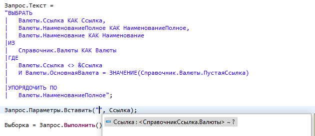
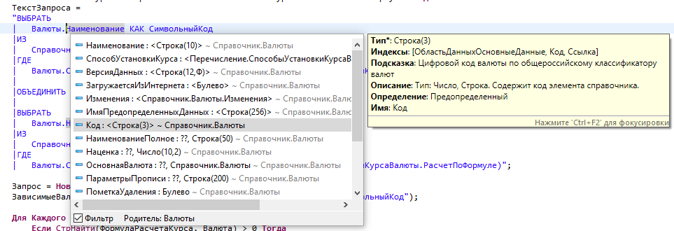
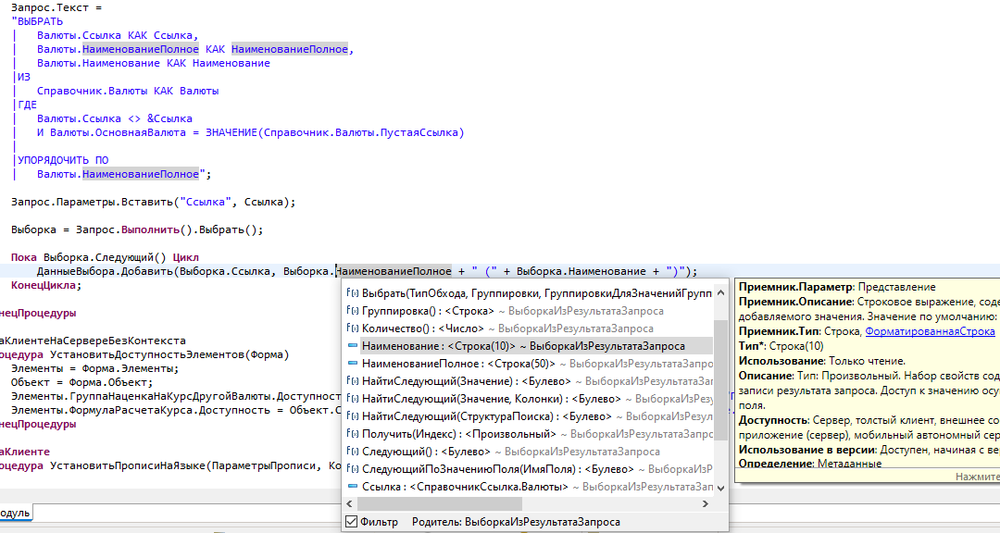

# Автодополнение

Улучшение контекстной подсказки (**content assist**) в **редакторе BSL** — модули объектов, форм, общие модули. Окно редактора — см. [Редактор модуля](redaktor-modulya.md).

## Настройки

| Параметр | Где | Эффект |
|----------|-----|--------|
| **Улучшать списки** | Параметры → Комфорт | **Обязательна** для всех улучшений подсказки; при выключении — штатный assist EDT |
| **Автооткрытие подсказок при вводе** | Параметры → Комфорт → Редактор кода | Открывает popup при вводе (см. триггеры ниже); по умолчанию **включено** |

Без **Улучшать списки** настройки группы «Редактор кода» не включают улучшенный assist — остаётся только штатное поведение EDT (в т.ч. его автооткрытие, если оно включено).

Алгоритм фильтрации совпадает с [фильтрами по подстроке в списках](obshchie-mekhanizmy.md#filtry-po-podstroke-v-spiskah): текст дробится на фрагменты по пробелам, для совпадения нужно вхождение **каждого** фрагмента (с мягким учётом порядка).

## Умный фильтр и панель popup

При включённом **Улучшать списки**:

- Список **фильтруется по мере ввода** идентификатора — не штатный prefix-match EDT.
- Внизу popup — панель с флажком **Фильтр** (по умолчанию **включён**) и подписью **Родитель:** — тип объекта слева от точки в выражении (`Объект.Свойство`). В строковом литерале при подключённом ИР **Родитель:** показывает контекст из ИР.
- **Ctrl+Space при открытом popup** — переключить фильтр: отфильтрованный список ↔ полный список (повторное Ctrl+Space). Штатное повторное открытие assist EDT в этом режиме не дублируется.
- Флажок **Фильтр** на панели — то же переключение, что Ctrl+Space при открытом popup.

## Автооткрытие при вводе

Если включено **Автооткрытие подсказок при вводе** и **Улучшать списки**, popup открывается при вводе (с учётом **задержки**):

- буквы кириллицы и латиницы;
- `.` после идентификатора (member-access);
- `_`, `&`, `~`, `#`;
- `=` и пробел в подходящем контексте;
- `"` внутри строкового литерала.

В **строчных комментариях** (`//`) автооткрытие срабатывает только для member-access: точка после идентификатора или буквы после точки.

Набор символов-триггеров в интерфейсе **не настраивается** (задан в плагине).

## Подсказка по параметрам метода

При вводе `(` или `,` внутри вызова метода автоматически открывается подсказка со списком параметров ([#135](https://github.com/tormozit/EDT.Comfort/issues/135)). Текст подсказки формируется на основе сигнатуры метода и текущего контекста вызова ([#133](https://github.com/tormozit/EDT.Comfort/issues/133)).

## Оформление серверных вызовов

Опция **Серверные вызовы отдельным цветом** ([#66](https://github.com/tormozit/EDT.Comfort/issues/66)) — визуально выделяет серверные вызовы в коде. Настройка: **Параметры → Комфорт → Редактор кода**.

## Hover-подсказка на методе

При наведении на вызов метода в hover-подсказке выводится **директива компиляции** (например, `&НаСервере`) ([#145](https://github.com/tormozit/EDT.Comfort/issues/145)).

## Дополнение от ИР

При подключённом [приложении ИР](obshchie-mekhanizmy.md#integraciya-s-ir) и включённом **Улучшать списки**:

- В список **добавляются строки ИР** — формат `Имя : <Тип> ~ Родитель`, у методов в имени — `()`.
- При выборе строки в боковой панели показывается **HTML-описание** из ИР (как в редакторе ИР).
- **Ctrl+Space при закрытом popup** — запросить или обновить подсказку с учётом данных ИР (при отсутствии сеанса ИР команда не перехватывается).
- **Строковые литералы** BSL (в т.ч. многострочные): штатные варианты EDT плюс слова ИР; удобно для текста запросов, путей и произвольных строк в кавычках.
- Устранено протухание кэша слов глобального контекста ЕДТ при подключённом ИР.

## Иллюстрации

Подсказка для параметра запроса по контексту строки запроса:

Список с данными ИР и HTML-описанием:

Подсказка внутри строкового литерала:

## Исправления

- При открытии автодополнения через **Ctrl+Space** последующая вставка метода теперь корректно ставит каретку внутрь скобок ([#127](https://github.com/tormozit/EDT.Comfort/issues/127)).
- При вставке ИР-слова через маску общего модуля теперь удаляется маска ([#120](https://github.com/tormozit/EDT.Comfort/issues/120)).
- Генератор `<Создать переменную>` теперь появляется в списке автодополнения ([#128](https://github.com/tormozit/EDT.Comfort/issues/128)).
- Исправлено автооткрытие автодополнения при вводе `&` ([#125](https://github.com/tormozit/EDT.Comfort/issues/125)).

## Ограничения

- Только **редактор BSL**; другие текстовые редакторы EDT не затрагиваются (кроме [редакторов запросов](redaktor-zaprosa.md) — см. ниже).
- Функции ИР: **Windows**, **COM**, обработка ИР в базе — см. [Известные ограничения](izvestnye-ogranicheniya.md).
- Отдельной команды и привязки в [Горячие клавиши](goryachie-klavishi.md) нет; **Ctrl+Space** описан в этом разделе.

## Связанные разделы

- [Редактор модуля](redaktor-modulya.md)
- [Редактор запроса](redaktor-zaprosa.md) — модификация автодополнения для языка запросов ([#132](https://github.com/tormozit/EDT.Comfort/issues/132))
- [Настройки](nastroyki.md)
- [Общие механизмы → Фильтры по подстроке](obshchie-mekhanizmy.md#filtry-po-podstroke-v-spiskah)
