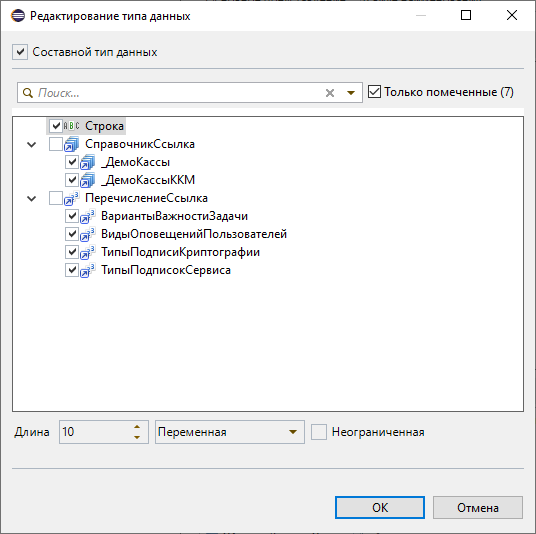

# Диалог выбора типа

Диалог выбора типа данных (в т. ч. поле «Тип» в мастере «Новый реквизит»).

## Фильтры

- [Фильтры по подстроке](obshchie-mekhanizmy.md#filtry-po-podstroke-v-spiskah) в списке типов — здесь доступен и иерархический вариант (точка делит фильтр на секции «категория.имя», например `Справ.Вал` найдёт `СправочникСсылка.Валюты`) ([#146](https://github.com/tormozit/EDT.Comfort/issues/146), [#147](https://github.com/tormozit/EDT.Comfort/issues/147)).

## Окно «Редактирование типа данных»

В окне редактирования типа данных доступны дополнительные возможности ([#148](https://github.com/tormozit/EDT.Comfort/issues/148)):

- **Флажок «Только помеченные»** — показать только отмеченные типы; состояние запоминается и применяется при открытии окна.
- **Кнопка «Лучший ИР»** (видна, если к проекту подключены «Инструменты разработчика») — помечает тип, который ИР подбирает по имени реквизита, как при автоподборе типа в окне «Новый реквизит». Без флажка «Составной тип данных» пометка заменяет прежнюю, с флажком — добавляется к помеченным.

