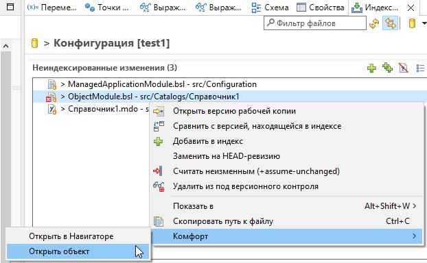
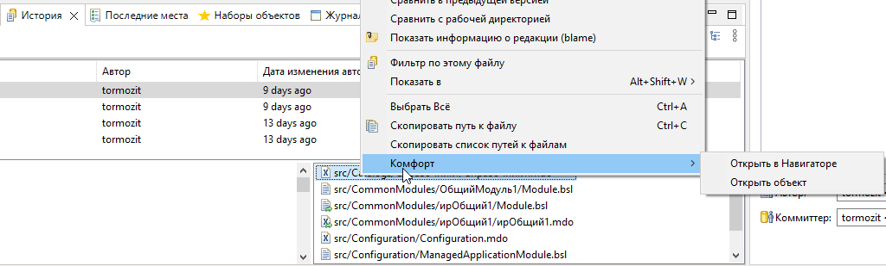

# Git: история и изменённые файлы

Команды и доработки Комфорт в представлениях EGit.

## Где работает

- представления **Staging**, **Repository Explorer**;
- панель **История** (History);
- панель **Индексирование Git**.

## Staging / Repository Explorer

Контекстное меню в списках изменённых файлов Git. Подменю **Комфорт**:

| Действие | Клавиши | Описание |
|----------|---------|----------|
| Открыть в Навигаторе | Ctrl+T | Выделить соответствующий объект в [навигаторе](navigator.md) |
| Открыть объект | F2 | Открыть объект метаданных в редакторе EDT |

Команды доступны при выборе файла конфигурации, для которого удаётся определить объект метаданных.

## История Git

В списке файлов коммита — колонка **«Путь»** с полным именем объекта метаданных и поле [фильтра](obshchie-mekhanizmy.md#filtry-po-podstroke-v-spiskah) с раскраской вхождений ([#184](https://github.com/tormozit/EDT.Comfort/issues/184)).
В контекстном меню списка **коммитов** — команда **«Сравнить рабочий каталог с коммитом»** ([#21](https://github.com/tormozit/EDT.Comfort/issues/21)).

## Индексирование Git

В списке файлов панели отображается полное имя метаданных; фильтр заменён на многословный с историей и раскраской ([#183](https://github.com/tormozit/EDT.Comfort/issues/183)).

## См. также

- [Навигатор](navigator.md)
- [Горячие клавиши → Git](goryachie-klavishi.md#git)
