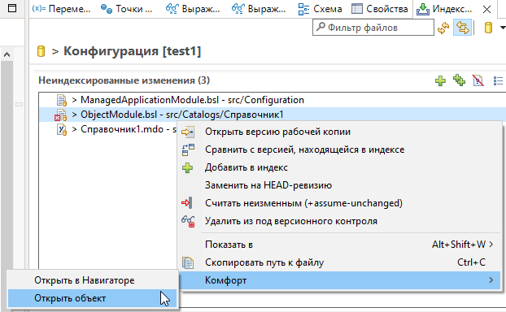
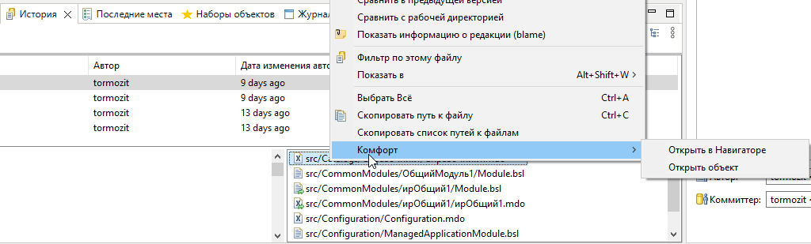

# Git: история и изменённые файлы
Команды и доработки Комфорт в представлениях Git в EDT.
## Где работает
- панель **«Индексирование Git»**;
- панель **«История»**;
- окно **«Результат получения изменений»**.

## Команды в списках файлов
В списках изменённых файлов конфигурации — подменю **Комфорт**:
| Действие | Клавиши | Описание |
|----------|---------|----------|
| Открыть в Навигаторе | Ctrl+T | Выделить соответствующий объект в [навигаторе](navigator.md) |
| Открыть объект | F2 | Открыть объект метаданных в редакторе EDT |
| Свернуть все другие | — | В деревьях файлов — свернуть все ветки, кроме родителей выделения ([общие механизмы](obshchie-mekhanizmy.md#svernut-vse-drugie)) |
Команды доступны при выборе файла конфигурации, для которого удаётся определить объект метаданных. При нескольких выделенных файлах команды открытия и навигации относятся к **текущей строке**.

## История
Если связь с текущим редактором выключена, панель при открытии показывает историю репозитория (последнего выбранного или репозитория активного проекта). Репозиторий выбирается в подменю панели инструментов.
В панели поиска коммитов (поле **«Найти»**) запоминаются последние запросы: кнопка **▾** у поля и **Ctrl+↓**. История сохраняется между запусками EDT.
В списке файлов коммита — колонки **«Файл»**, **«Тип»**, **«Путь»** (полное имя объекта метаданных) и **«Статус»** (Добавлен / Изменён / Удалён / …); сортировка по клику на заголовок колонки; поле [фильтра](obshchie-mekhanizmy.md#filtry-po-podstroke-v-spiskah) с раскраской вхождений ([#184](https://github.com/tormozit/EDT.Comfort/issues/184), [#230](https://github.com/tormozit/EDT.Comfort/issues/230)). **Ctrl+C** копирует текст активной ячейки.
В подменю **Комфорт** списка файлов коммита — команда **«История ИР»**: открывает инструмент «История Гита» в приложении ИР с отбором по файлу и коммиту ([#113](https://github.com/tormozit/EDT.Comfort/issues/113)).
В контекстном меню таблицы — команды **отбора по значению ячейки** («Отобрать», «Снять отбор», «Различные значения колонки», «Отключить все отборы») — см. [Отбор по значению колонки](obshchie-mekhanizmy.md#otbor-po-znacheniyu-kolonki).
Модуль, открытый из коммита (вкладка вида «Module.bsl …»), подсвечивает текущий идентификатор так же, как редактор модуля проекта — см. [Выделение текущего идентификатора](redaktor-modulya.md#vydelenie-tekushchego-identifikatora).
В контекстном меню списка **коммитов** — команда **«Сравнить рабочий каталог с коммитом»** ([#21](https://github.com/tormozit/EDT.Comfort/issues/21)). Сравниваемый проект определяется по репозиторию самой панели «История» (не по активному редактору); если репозиторию соответствует несколько открытых проектов — предлагается выбрать проект.
Если в списке коммитов включён отбор **«Все изменения ресурса»**, то по окончании построения дерева различий в нём автоматически выделяется строка объекта, открытого в активном редакторе (если этот объект есть в сравнении). Фокус при этом передаётся дереву только тогда, когда редактор сравнения и так активен.
В диалоге **«Выбор коммита»** (команды сравнения с коммитом) — флажок **«Разрешить удаление объектов главного источника»** под штатными настройками. По умолчанию **включён** (штатное поведение); при снятии сравнение не предлагает удалять объекты, присутствующие только в главном источнике ([#242](https://github.com/tormozit/EDT.Comfort/issues/242)). Там же запоминаются размер окна и состояние штатного флажка **«Сравнивать модули с учетом структуры»** — при следующем открытии диалог восстанавливает их.
## Индексирование Git
Дерево файлов получает колонки **«Имя»**, **«Тип»**, **«Путь»** (полное имя метаданных), **«Время изменения»** и **«Статус»**; фильтр — многословный с историей и раскраской ([#183](https://github.com/tormozit/EDT.Comfort/issues/183), [#230](https://github.com/tormozit/EDT.Comfort/issues/230), [#267](https://github.com/tormozit/EDT.Comfort/issues/267)). **Ctrl+C** копирует текст активной ячейки; при нескольких выделенных строках — ячейки активной колонки по всем выделенным строкам.
Порядок и ширины колонок синхронизируются между списками «Индексированные изменения» и «Неиндексированные изменения»; колонки растягиваются и сужаются вместе с панелью — см. [Порядок и ширина колонок](obshchie-mekhanizmy.md#poryadok-i-shirina-kolonok).
В контекстном меню дерева — команды **отбора по значению ячейки** (см. [Отбор по значению колонки](obshchie-mekhanizmy.md#otbor-po-znacheniyu-kolonki)).
Перетаскивание объекта метаданных из [навигатора](navigator.md), [последних мест](poslednie-mesta.md) или [наборов объектов](nabory-obektov.md) на список «Индексированные изменения» или «Неиндексированные изменения» снимает текущее выделение в этом списке и выделяет файлы сброшенного объекта — без файлов вложенных объектов (форм, макетов, команд и т.п.).
## Заменить на HEAD ревизию и «осиротевший» mdo :id=osirotevshij-mdo
Если объект метаданных **удалили** в EDT, а затем **восстановили только файлы mdo** через Git (без записи в `Configuration.mdo`), объект не появится в навигаторе и может «пропасть» из сравнения конфигураций. В [структуре проекта](struktura-proekta.md) такая папка помечается суффиксом **` <?>`**.
Команда **«Заменить на HEAD ревизию»** при обнаружении таких файлов **предупреждает** и при согласии **добавляет** указатель на объект в `Configuration.mdo` ([#236](https://github.com/tormozit/EDT.Comfort/issues/236)).
## Configuration.mdo — дубликаты
Перед **выгрузкой** и **обновлением конфигурации БД** Комфорт автоматически удаляет **дубли** child-записей в `Configuration.mdo` (одинаковые строки вида `<reports>Имя</reports>`), которые могут появиться после объединения конфигураций. При обнаружении дублей показывается уведомление с возможностью **«Показать различия»** ([#246](https://github.com/tormozit/EDT.Comfort/issues/246)).
## Отправка на сервер
При ошибке отправки на сервер Git Комфорт показывает [уведомление о завершении](obshchie-mekhanizmy.md#uvedomlenie-o-zavershenii-dlitelnyh-operacij) **«Завершено с ошибкой: Отправка на сервер Git …»**, если штатный диалог **«Результаты отправки»** не появился. Когда этот диалог уже на экране и окно EDT на переднем плане, уведомление не дублирует его ([#340](https://github.com/tormozit/EDT.Comfort/issues/340)).
## Результат получения изменений
В окне **«Результат получения изменений: …»** строки веток получают доработки ([#108](https://github.com/tormozit/EDT.Comfort/issues/108)).
**Двойной клик** по строке ветки показывает эту ветку в панели **«Репозитории Git»**: панель открывается, если была закрыта, и выводится на первый план, если её вытеснила другая вкладка. Если панель уже видна, фокус остаётся в окне результата.
**Контекстное меню** строки ветки содержит команду показа ветки в панели «Репозитории Git» и штатные команды Git над этой веткой: **«Извлечь (checkout)»**, **«Слить (merge)»**, **«Перебазировать»**, **«Создать ветку»**, **«Настроить ветку»**, **«Удалить ветку»**, **«Отправить ветку»**, **«Синхронизировать с рабочим каталогом»**. Команды выполняются так же, как из панели «Репозитории Git». Если команда в текущем состоянии репозитория неприменима, показывается уведомление.

## См. также
- [Структура проекта](struktura-proekta.md)
- [Навигатор](navigator.md)
- [Горячие клавиши → Git](goryachie-klavishi.md#git)
