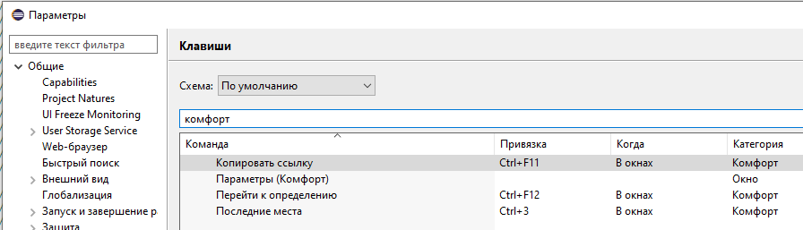

# Горячие клавиши

Категория **Комфорт** в **Параметры → Общие → Клавиши**. Значения по умолчанию (могут быть переназначены).

## Глобальные

| Команда | Клавиши | Примечание |
|---------|---------|------------|
| Перейти к определению | Ctrl+F12 | приоритет над EDT |
| Копировать ссылку | Ctrl+F11 | приоритет над EDT |
| Последние места | Ctrl+3 | открывает панель |
| Наборы объектов | — | назначьте в Клавиши при необходимости |
| Открыть объект конфигурации | Ctrl+2 | контекст «В окнах» |
| Вставить со сравнением | Ctrl+Alt+V | контекст «В окнах» |
| Сортировать строки текста | — | назначьте в Клавиши при необходимости; контекст «В окнах» |
| Открыть скелет коллекции | Ctrl+Shift+Alt+K | тестовая таблица без сервера |

## Текстовые редакторы

| Команда | Клавиши |
|---------|---------|
| Быстрый поиск вперёд (Комфорт) | Ctrl+F3 |
| Быстрый поиск назад (Комфорт) | Ctrl+Shift+F3 |
| Навигация по идентификатору | Ctrl+← / Ctrl+→ |
| Вставить со сравнением | Ctrl+Alt+V |
| Сортировать строки текста | — |

Подробнее — [Текстовые редакторы](redaktory-teksta.md).

## Редактор BSL (Xtext)

| Команда | Клавиши |
|---------|---------|
| Быстрая схема модуля | Ctrl+Ё |
| Конструктор метода ИР | Ctrl+Shift+M |
| Вложенный текст ИР | Ctrl+Shift+E |
| Форматировать текст ИР | Alt+Shift+F |
| Найти ссылки ИР | Контекстное меню → Комфорт |
| Проверить модуль ИР | Контекстное меню → Комфорт |

## Редактор запроса

Общие клавиши — см. [Текстовые редакторы](redaktory-teksta.md). Специфика — [Редактор запроса](redaktor-zaprosa.md).

## Сравнение конфигураций

| Команда | Клавиши |
|---------|---------|
| Открыть объект | F2 |
| Показать в навигаторе | Ctrl+T |
| Поиск по дереву | Ctrl+F | штатный диалог EDT с доработками Комфорт |

## Отладка

| Команда | Клавиши | Контекст |
|---------|---------|----------|
| Инспектировать переменную | F9 | переменные / выражения |
| Показать коллекцию | F2 | переменные / выражения |
| Инспектировать элемент | F2 | окно «Коллекция» |

## Git {#git}

| Команда | Клавиши | Где |
|---------|---------|-----|
| Открыть в Навигаторе | Ctrl+T | Staging, Repository Explorer, History |
| Открыть объект | F2 | Staging, Repository Explorer, History |

См. [Git: изменённые файлы](git-izmeneniya.md).

## Панели Комфорт

| Команда | Клавиши | Где |
|---------|---------|-----|
| Показать в навигаторе | Ctrl+T | «Последние места» |
| Показать в навигаторе | Ctrl+T | «Наборы объектов» |

## Редактор формы

| Команда | Клавиши | Где |
|---------|---------|-----|
| Показать в навигаторе | Ctrl+T | дерево реквизитов (поля «Объект.*») |

## Окно «Коллекция»

| Команда | Клавиши |
|---------|---------|
| Инспектировать | F2 |
| Копировать ячейку | Ctrl+C |
| Поиск по таблице | Ctrl+F |
| Следующее / предыдущее | F3 / Shift+F3 |

Переход по ссылке из буфера — кнопка **Перейти** на панели (отдельной глобальной клавиши может не быть).
