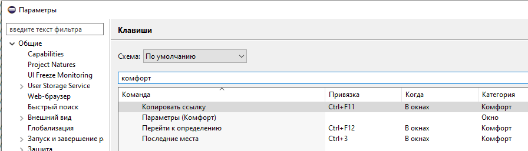

# Горячие клавиши
Категория **Комфорт** в **Параметры → Общие → Клавиши**. Значения по умолчанию (могут быть переназначены).

## Глобальные
| Команда | Клавиши | Примечание |
|---------|---------|------------|
| Перейти к определению | Ctrl+F12 | приоритет над EDT |
| Копировать ссылку | Ctrl+F11 | приоритет над EDT |
| Последние места | Ctrl+3 | открывает панель |
| Наборы объектов | — | назначьте в Клавиши при необходимости |
| Открыть объект конфигурации | Ctrl+2 | контекст «В окнах» |
| Перейти к родителю в дереве | Ctrl+Up | глобально; дерево с фокусом ([#83](https://github.com/tormozit/EDT.Comfort/issues/83)) |
| Развернуть / свернуть поддерево | Ctrl+клик по плюсику / минусу | все деревья; в сравнении конфигураций разворот — «До измененных» ([#10](https://github.com/tormozit/EDT.Comfort/issues/10)) |
| Вставить со сравнением | Ctrl+Alt+V | контекст «В окнах» |
| Сортировать строки текста | — | назначьте в Клавиши при необходимости; контекст «В окнах» |
| Отобрать по значению ячейки | Alt+W | список с фокусом; повторно — снять отбор ([отбор по значению колонки](obshchie-mekhanizmy.md#otbor-po-znacheniyu-kolonki)) |
| Различные значения колонки | Alt+F | список с фокусом; окно значений активной колонки |
| Открыть скелет коллекции | Ctrl+Shift+Alt+K | тестовая таблица без сервера |
## Редакторы текста
| Команда | Клавиши |
|---------|---------|
| Быстрый поиск вперёд (Комфорт) | Ctrl+F3 |
| Быстрый поиск назад (Комфорт) | Ctrl+Shift+F3 |
| Найти следующее / предыдущее | F3 / Shift+F3 |
| Навигация по идентификатору | Ctrl+← / Ctrl+→ |
| Вставить со сравнением | Ctrl+Alt+V |
| Сортировать строки текста | — |
Подробнее — [Редакторы текста](redaktory-teksta.md).
## Редактор BSL (Xtext)
| Команда | Клавиши |
|---------|---------|
| Быстрая схема модуля | Ctrl+Ё |
| Вложенный текст ИР | Ctrl+Shift+E |
| Конструктор запроса ИР | Контекстное меню → Комфорт |
| Конструктор метода ИР | Ctrl+Shift+M |
| Найти ссылки ИР | Контекстное меню → Комфорт |
| Объявить тип выражения ИР | Контекстное меню → Комфорт |
| Очистить ошибки ИР | Контекстное меню → Комфорт |
| Проверить модуль ИР | Контекстное меню → Комфорт |
| Сбросить сворачиваемые группы | Ctrl+Shift+Num* |
| Форматировать текст ИР | Alt+Shift+F |
## Редактор запроса
Общие клавиши — см. [Редакторы текста](redaktory-teksta.md). Специфика — [Редактор запроса](redaktor-zaprosa.md).
## Сравнение конфигураций
| Команда | Клавиши |
|---------|---------|
| Открыть объект | F2 |
| Показать в навигаторе | Ctrl+T |
| Поиск по дереву | Ctrl+F | штатный диалог EDT с доработками Комфорт |
| Найти следующее / предыдущее (текст сравнения) | F3 / Shift+F3 | текстовые панели 2-way и 3-way |
## Отладка
| Команда | Клавиши | Контекст |
|---------|---------|----------|
| Инспектировать переменную | F9 | переменные / выражения |
| [Инспектировать](inspektor-peremennyh.md#inspektirovat-iz-redaktora-modulya) | Shift+F9 | редактор модуля: выделение, выражение под кареткой либо пустой ввод на пустом месте (сочетание EDT) |
| Показать коллекцию | F2 | переменные / выражения |
| Инспектировать элемент | F2 | окно «Коллекция» |
## Git :id=git
| Команда | Клавиши | Где |
|---------|---------|-----|
| Открыть в Навигаторе | Ctrl+T | «Индексирование Git», «История» |
| Открыть объект | F2 | «Индексирование Git», «История» |
| Копировать текст ячейки | Ctrl+C | «Индексирование Git», «История» |
См. [Git: изменённые файлы](git-izmeneniya.md).
## Панели Комфорт
| Команда | Клавиши | Где |
|---------|---------|-----|
| Показать в навигаторе | Ctrl+T | «Последние места» |
| Показать в навигаторе | Ctrl+T | «Наборы объектов» |
## Поля фильтра
| Клавиши | Действие |
|---------|----------|
| ↓ / ↑ / PgDn / PgUp | Перемещение по строкам списка, фокус остаётся в поле фильтра |
| Enter | Основное действие по текущей строке |
| Ctrl+↓ | История прошлых запросов фильтра |
См. [Фильтры по подстроке в списках](obshchie-mekhanizmy.md#filtry-po-podstroke-v-spiskah).
## Редактор формы
| Команда | Клавиши | Где |
|---------|---------|-----|
| Показать в навигаторе | Ctrl+T | дерево реквизитов (поля «Объект.*») |
## Окно «Коллекция»
| Команда | Клавиши |
|---------|---------|
| Инспектировать | F2 |
| Копировать ячейку | Ctrl+C |
| Поиск по таблице | Ctrl+F |
| Следующее / предыдущее | F3 / Shift+F3 |
Переход по ссылке из буфера — кнопка **Перейти** на панели (отдельной глобальной клавиши может не быть).
