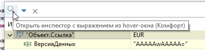
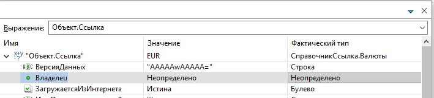
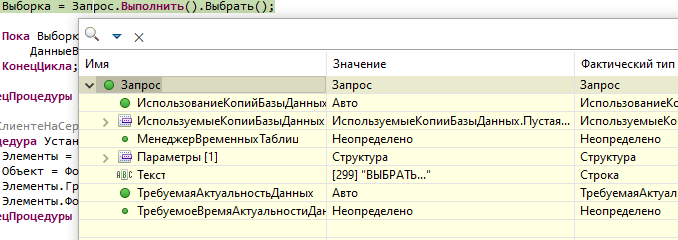

# Инспектор переменных

Окно просмотра значения при отладке: **F9**, hover по выражению в редакторе или отдельное окно.

Требуется **Улучшать окна отладчика** в [настройках](nastroyki.md) для полного набора доработок и горячих клавиш.

## Заголовок окна

- **×** — закрыть.
- **Обновлять** (hover) — следовать за курсором; при снятии окно закрепляется.
- **Автозакрытие** (отдельное окно F9) — закрывать при потере фокуса.

## Дерево значений

- Выбор строки кликом в любой колонке, подсветка активной ячейки.
- **Ctrl+C** — копирование ячейки.
- **Ctrl+F** / **F3** — поиск по дереву.
- **F2** — [Показать коллекцию](okno-kollektsii.md) для коллекций (фильтр, split-таблица, клонирование и др.).
- Двойной щелчок — редактирование значения (где поддерживается).
- В hover — **Инспектировать** для перехода к отдельному окну.

## Иллюстрации

## Связанные разделы

- [Улучшения окон отладчика](obshchie-mekhanizmy.md#uluchsheniya-okon-otladchika)
- [Отладить объект ИР](obshchie-mekhanizmy.md#otladit-obekt-ir) — углублённая отладка значения в приложении ИР (не путать с инспектором)
- [Окно «Коллекция»](okno-kollektsii.md)
