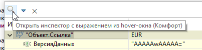
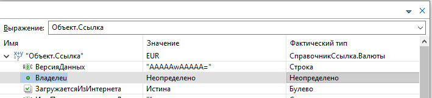
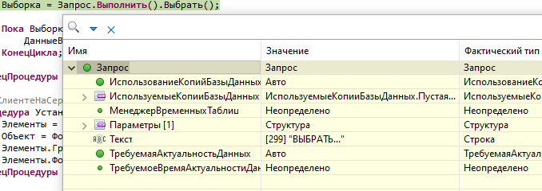

# Инспектор переменных

Окно просмотра значения при отладке: **F9**, hover по выражению в редакторе или отдельное окно.

Требуется **Улучшать окна отладчика** в [настройках](nastroyki.md) для полного набора доработок и горячих клавиш.

## Заголовок окна

- **×** — закрыть.
- **Обновлять** (hover) — следовать за курсором; при снятии окно закрепляется.
- **Автозакрытие** (отдельное окно F9) — закрывать при потере фокуса.
- Пока указатель на hover-инспекторе, нажатие и отпускание Ctrl окно не закрывают.

## Дерево значений

- Подсветка активной ячейки.
- **Ctrl+C** — копирование ячейки.
- **Ctrl+F** / **F3** — поиск по дереву.
- **F2** — [Показать коллекцию](okno-kollektsii.md) для коллекций (фильтр, split-таблица, клонирование и др.).
- Двойной щелчок — редактирование значения (где поддерживается).
- В hover — **Инспектировать** для перехода к отдельному окну.
- Панель деталей под деревом показывает **полный текст** значения, даже если в колонке он обрезан ([#258](https://github.com/tormozit/EDT.Comfort/issues/258)).
- Колонки растягиваются и сужаются вместе с окном — см. [Порядок и ширина колонок](obshchie-mekhanizmy.md#poryadok-i-shirina-kolonok).

## Инспектировать из редактора модуля :id=inspektirovat-iz-redaktora-modulya

**Клавиши:** Shift+F9 (сочетание EDT, настраивается в **Параметры → Общие → Клавиши**)

Команда EDT **«Инспектировать»** открывает окно значения для выражения в редакторе модуля (в том числе модуля формы). Плагин выравнивает её поведение с клавиатуры и из контекстного меню редактора и добавляет вызов на пустом месте:

| Каретка | Штатное поведение EDT | С плагином |
|---------|----------------------|------------|
| Текст выделен | Открывается окно по выделению | Так же |
| Внутри выражения, без выделения | С клавиатуры **ничего не происходит**, хотя одноимённый пункт контекстного меню окно открывает | Открывается окно по выражению под кареткой |
| На пустом месте | Ничего не происходит | Открывается окно с пустым полем ввода |

Причина расхождения в EDT: сочетание Shift+F9 привязано к действию, доступность которого считается по наличию выделенного текста, тогда как пункт меню при пустом выделении разбирает текст под кареткой.

Выражение под кареткой плагин определяет по модулю — берётся **минимальное целостное выражение**:

| Каретка | Выражение |
|---------|-----------|
| в имени вызываемого метода | весь вызов со скобками и аргументами: `ТекущаяДатаСеанса()` |
| в звене цепочки `Список.КомпоновщикНастроек.Настройки` | цепочка до этого звена: `Список.КомпоновщикНастроек` |
| в литерале | сам литерал: `"Курс"` |
| на пробеле, в конце строки, в комментарии | пусто — окно открывается с пустым полем |

В открытом окне есть поле ввода выражения с историей, поэтому вызов на пустом месте — это способ вычислить произвольное выражение с нуля.

Команда доступна только при остановке отладчика на точке останова (в панели **«Отладка»** выбран кадр стека). Иначе показывается [уведомление о том, что команда недоступна](obshchie-mekhanizmy.md#uvedomlenie-o-vyzvannoj-komande).

## Редактирование текстовых свойств

Для **текстовых** (тип «Строка») редактируемых свойств в подменю **Комфорт** контекстного меню дерева — два пункта ([#268](https://github.com/tormozit/EDT.Comfort/issues/268)):

| Команда | Описание |
|---------|----------|
| **Редактировать текст ИР** | Открыть текст свойства в текстовом редакторе [приложения ИР](obshchie-mekhanizmy.md#integraciya-s-ir) |
| **Редактировать текст запроса** | Открыть текст свойства в редакторе запроса |

Отредактированный текст возвращается в значение свойства отладчика. Пункты работают и в попап-инспекторе, и в отдельном окне.

## Иллюстрации

## Связанные разделы

- [Улучшения окон отладчика](obshchie-mekhanizmy.md#uluchsheniya-okon-otladchika)
- [Отладить объект ИР](obshchie-mekhanizmy.md#otladit-obekt-ir) — углублённая отладка значения в приложении ИР (не путать с инспектором)
- [Окно «Коллекция»](okno-kollektsii.md)
