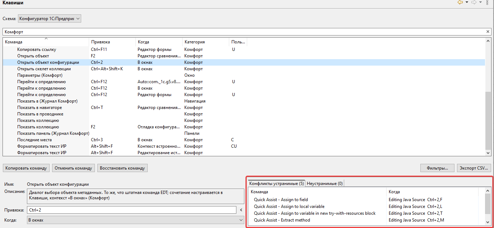

# Настройки

**Параметры → Комфорт**

## Версия плагина

Установленная и доступная версия, даты, ссылки на список изменений, проверка обновлений с сайта. На странице настроек также доступны гиперссылки **«Домашняя страница»** и **«Создать заявку»**. «Создать заявку» открывает форму GitHub с предзаполненным телом: версия Комфорт, версия 1C:EDT (маркетинговая и внутренняя), ОС, светлая или тёмная тема, сведения ИР (если подключён), свёрнутый список установленных плагинов кроме поставляемых с EDT и свёрнутый список флажков Комфорт ([#151](https://github.com/tormozit/EDT.Comfort/issues/151), [#305](https://github.com/tormozit/EDT.Comfort/issues/305)).

## Улучшать списки

См. [Улучшать списки](uluchshenie-spiskov.md) — полное описание флажка, механизмов и момента их применения. По умолчанию **включено**.

## Группировать общие модули в навигаторе по имени

| Параметр | Описание |
|----------|----------|
| Группировать общие модули в навигаторе по имени | Визуально сворачивает семейства общих модулей с одинаковой основой имени в одну группу дерева [навигатора](navigator.md); структура конфигурации не меняется. По умолчанию **выключено** |
| Суффиксы набора 1 (через запятую) | Комбинируемые суффиксы хвоста имени (любое количество в цепочке). По умолчанию: Клиент, Сервер, ПовтИсп, ВызовСервера, Кэш, Глобальный |
| Суффиксы набора 2 (через запятую) | Не более одного суффикса из набора в хвосте — в любой позиции относительно набора 1. По умолчанию: Переопределяемый, Изменяемый, Служебный |

Подробнее — [Навигатор](navigator.md) ([#68](https://github.com/tormozit/EDT.Comfort/issues/68)).

## Вертикальные вкладки в редакторе объекта

Если включено и вкладок больше 10, список вкладок [редактора объекта метаданных](redaktor-obekta-metadannyh.md#vertikalnye-vkladki) показывается слева, с картинками. По умолчанию **выключено** — вкладки снизу, тоже с картинками.

## Улучшать окна отладчика

См. [Улучшения окон отладчика](obshchie-mekhanizmy.md#uluchsheniya-okon-otladchika). Включает доработки инспектора (F9/hover), колонки «Значение» в переменных/выражениях, F2 «Показать коллекцию» и др.

## Редактор кода

| Параметр | Описание |
|----------|----------|
| Автооткрытие автодополнения при вводе | [Автодополнение](avtodopolnenie.md) — работает вместе с **Улучшать списки** |
| Автооткрытие автодополнения: Задержка (мс) | 0–10000; 0 — без паузы |
| Ctrl+клик выделяет слово | См. [Редакторы текста → Ctrl+клик выделяет слово](redaktory-teksta.md#ctrl-klik-vydelyaet-slovo) |
| Серверные вызовы отдельным цветом | См. [Редактор модуля → Оформление серверных вызовов](redaktor-modulya.md#oformlenie-servernyh-vyzovov) ([#66](https://github.com/tormozit/EDT.Comfort/issues/66)) |
| Отображать начало конструкции в её конце | См. [Редактор модуля → Подсказка начала конструкции](redaktor-modulya.md#podskazka-nachala-konstrukcii) ([#80](https://github.com/tormozit/EDT.Comfort/issues/80)) |
| Проверять орфографию в идентификаторах в видимой области | См. [Орфография](orfografiya.md) ([#175](https://github.com/tormozit/EDT.Comfort/issues/175)) |

## Орфография

См. [Орфография](orfografiya.md) — словари HUNSPELL, локальный и проектный словарь, CamelCase. Основные флажки — на странице **Параметры → Общие → Орфография** и в группе **Редактор кода** выше.

## Фильтр окна «Параметры»

Поле фильтра в окне **Параметры** ищет не только по именам страниц, но и по **текстам настроек** на страницах ([#162](https://github.com/tormozit/EDT.Comfort/issues/162)).

## Журнал

| Параметр | Описание |
|----------|----------|
| Вести журнал | Запись в [Журнал Комфорт](zhurnal-komfort.md) |
| Ссылка «Журнал» | Открыть представление |

В представлении **Журнал Комфорт** кнопка **Автопрокрутка** включает прокрутку к новым записям (по умолчанию включена).

## Клавиши

Ссылка на страницу **Клавиши** с фильтром категории **Комфорт**.
На странице **Клавиши** для категории **Комфорт** отображается список **локальных конфликтов** — сочетаний, которые одновременно назначены нескольким командам в одном контексте. Двойной щелчок по строке конфликта открывает соответствующую команду для редактирования ([#171](https://github.com/tormozit/EDT.Comfort/issues/171)).

