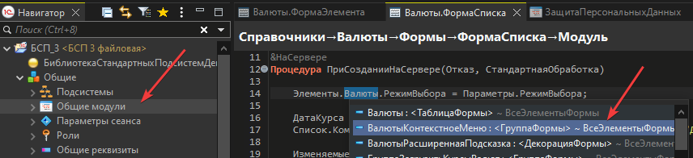
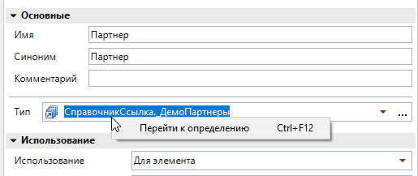
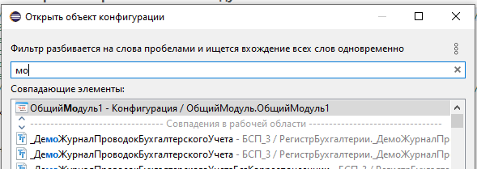

# Общие механизмы

Возможности Комфорт, которые работают **в нескольких окнах** EDT или **глобально**. Специфика конкретного окна — в соответствующем файле. Функции **текстовых редакторов** — [Текстовые редакторы](redaktory-teksta.md).

---

## Фильтры по подстроке в списках {#filtry-po-podstroke-v-spiskah}

**Настройка:** Параметры → Комфорт → **Улучшать списки**.

Два вида фильтра — какой доступен, зависит от конкретного окна.

**Многословный** — базовый вид, работает везде. Текст фильтра дробится на фрагменты по пробелам; для совпадения требуется вхождение **каждого** фрагмента (с мягким учётом порядка), совпадения подсвечиваются.

**Где работает:** список информационных баз, быстрая схема модуля, [списки автодополнения](avtodopolnenie.md), панели «Последние места» и «Наборы объектов», [панель «Результаты поиска»](rezultaty-poiska.md) — и как базовый режим везде, где ниже указан иерархический фильтр.

**Иерархический** — расширяет многословный для списков с уровнями (тип объекта → сам объект). Точка в тексте фильтра (вне кавычек) делит его на **секции** — по одной на уровень. Секции сравниваются с полным именем элемента **с конца**: последняя секция — с именем самого элемента, предыдущая — с именем его родителя, и т. д.

- `Справ.Вал` — секция `Справ` ищется у родителя (например, «Справочник»), секция `Вал` — у самого элемента (например, «Валюты»); без точки в фильтре сравнение всегда идёт только с именем самого элемента (родитель не проверяется).
- `"Справ.Вал"` (в кавычках) — точная фраза целиком, точка внутри кавычек секции не образует.
- Кавычками можно «спрятать» и пробел внутри одного фрагмента: `"их вал"` ищется как одна фраза, а не как два отдельных слова.
- Найденный элемент, если дерево свёрнуто, раскрывается автоматически.

**Где работает:** [панель «Навигатор»](navigator.md), [диалог выбора объекта](dialog-vybora-obekta.md), [диалог выбора типа](dialog-vybora-tipa.md) (включая поле «Тип» в мастере «Новый реквизит» и панели «Свойства») ([#146](https://github.com/tormozit/EDT.Comfort/issues/146), [#147](https://github.com/tormozit/EDT.Comfort/issues/147)).

В тёмной теме EDT выделение строки в списках сделано заметнее:

> **Примечание:** при переключении флажка **Улучшать списки** большинство механизмов реагируют сразу. Доработка поля **«Тип»** применяется только при следующем старте EDT. Подробнее — [Улучшать списки](uluchshenie-spiskov.md).

---

## Копирование ссылки {#kopirovanie-ssylki}

**Клавиши:** Ctrl+F11 (приоритет над локальными привязками EDT)  
**Панель:** **Ссылка**

Копирует в буфер ссылку на объект метаданных, модуль или строку кода.

---

## Переход к определению {#perehod-k-opredeleniyu}

**Клавиши:** Ctrl+F12 (приоритет над EDT, в т.ч. в редакторе форм)

Переход к объявлению символа, объекту метаданных или строке модуля. При подключённом ИР может использовать его механизмы.

Команда **«Перейти к определению»** также доступна в контекстном меню **всех полей ввода**, содержащих ссылки на метаданные ([#144](https://github.com/tormozit/EDT.Comfort/issues/144)):

---

## Переход по ссылке {#perehod-po-ssylke}

**Панель:** **Перейти**

Читает ссылку из буфера обмена и открывает соответствующее место в EDT.

---

## Открыть объект конфигурации {#otkryt-obekt-konfiguracii}

**Клавиши:** Ctrl+2 (контекст «В окнах»)

Диалог выбора объекта метаданных — аналог штатной команды EDT; сочетание настраивается в **Параметры → Общие → Клавиши**, контекст **В окнах**.

---

## Вставить со сравнением

**Клавиши:** Ctrl+Alt+V (контекст «В окнах»; срабатывает при фокусе в редактируемом текстовом поле)

Сравнение выделенного фрагмента с буфером обмена и вставка отредактированного текста.

Полное описание — [Текстовые редакторы → Вставить со сравнением](redaktory-teksta.md#vstavka-so-sravneniem).

---

## Автодополнение

Улучшает контекстную подсказку в **редакторе BSL**: умный фильтр, автооткрытие при вводе, при подключённом [приложении ИР](#integraciya-s-ir) — дополнительные варианты и HTML-описания (в т.ч. в строковых литералах).

**Настройки:** **Улучшать списки** (обязательна) и группа **Редактор кода** в [Параметрах](nastroyki.md).

Полное описание — [Автодополнение](avtodopolnenie.md).

---

## Команды ИР в редакторе BSL {#komandy-ir-v-redaktore-bsl}

Активны **только при подключённом приложении ИР**. Сочетания — в контексте **Редактирование источника Xtext** (см. [Горячие клавиши](goryachie-klavishi.md)):

| Команда | Назначение |
|---------|------------|
| Конструктор метода ИР | Создание/редактирование метода через ИР |
| Вложенный текст ИР | Редактирование строкового литерала в редакторе текста ИР |
| Форматировать текст ИР | Форматирование выделения через ИР |
| Найти ссылки ИР | Поиск ссылок на символ через ИР ([#86](https://github.com/tormozit/EDT.Comfort/issues/86)) |
| Проверить модуль ИР | Передача модуля на проверку в ИР ([#138](https://github.com/tormozit/EDT.Comfort/issues/138)) |
| Отладить объект ИР | см. [Отладить объект ИР](#otladit-obekt-ir) |

---

## Отладить объект ИР {#otladit-obekt-ir}

Выражение или значение передаётся в отладочный инструмент **ИР** — открывается окно приложения ИР или окно отлаживаемого клиента 1С. Горячих клавиш нет, только контекстное меню.

### Где доступна

| Контекст | Как вызвать | Что передаётся |
|----------|-------------|----------------|
| Редактор BSL | Контекстное меню (корневой уровень, не подменю «Комфорт») | Выделенный фрагмент или выражение под курсором в контексте текущей строки модуля |
| **Переменные** | Контекстное меню, одна выбранная переменная | Значение переменной как выражение отладки |
| **Выражения** | Контекстное меню, одно выбранное выражение | Текст выражения из списка |
| **Параметры точки останова** | Команда «Выводить ИР» ([#136](https://github.com/tormozit/EDT.Comfort/issues/136)) | Настройка вывода ИР при срабатывании точки останова |

Подробнее по контекстам: [Редактор модуля](redaktor-modulya.md), [Переменные и выражения](predstavleniya-otladki.md).

### Условия

- Подключено [приложение ИР](#integraciya-s-ir).
- **Отладка на паузе** (остановка на точке останова) для проекта текущей сессии.
- Для редактора BSL пункт виден только при остановке в модуле этого проекта.

### Поведение

1. Модуль синхронизируется с сеансом ИР (как при других командах ИР).
2. ИР разбирает контекст текущей строки или выражения и формирует вызов отладки.
3. EDT вычисляет выражение в контексте текущего кадра стека отладки.
4. Результат открывается в ИР или активируется окно **толстого клиента** (если отладка идёт через клиентское приложение).

### Особые случаи

- **Многострочное логическое выражение** (начинается с `Истина` / `Ложь`) — в ИР открывается **расшифровка** выражения в текстовом редакторе, а не стандартная отладка объекта.
- **Отложенная отладка** — если результат содержит предложение «открыть объект для отладки», ИР открывает отложенный объект.
- Если снимок объекта **не успел появиться** — уведомление с просьбой повторить команду или активировать окно отлаживаемого приложения.

### Отличие от инспектора (F9)

[Инспектор переменных](inspektor-peremennyh.md) показывает значение в EDT или hover. **Отладить объект ИР** передаёт задачу в **Инструменты разработчика** для углублённой отладки (исследователь, консоль и т.п.).

**Ограничения:** Windows, COM, ИР в базе — см. [Известные ограничения](izvestnye-ogranicheniya.md).

---

## Интеграция с ИР {#integraciya-s-ir}

Автоматическое подключение служебного клиентского приложения текущей базы 1С (COM). Требуются установленные ИР в базе; при первой регистрации COM может понадобиться запуск EDT от администратора.

Настройки на базу — в [Панель «Приложения»](prilozheniya.md) и [Синхронизация базы](sinhronizaciya-bazy.md).

### Редактор ИР для макетов

При подключённом ИР доступна команда **Редактор ИР** для редактирования в приложении ИР с последующим возвратом в EDT:

| Объект | Где вызвать | Справка |
|--------|-------------|---------|
| Табличный документ | Контекстное меню вкладки **Табличный документ** | [Редактор макета](redaktor-maketa.md) |
| Схема компоновки данных | Кнопка на панели вкладки **Макет** (СКД) | [Схема компоновки данных](skhema-komponovki-dannyh.md) |

Возврат изменений — через штатный переход из ИР в EDT ([Переход к определению](#perehod-k-opredeleniyu)). Не редактируйте тот же объект одновременно в обеих средах.

---

## Улучшения окон отладчика {#uluchsheniya-okon-otladchika}

**Настройка:** Параметры → Комфорт → **Улучшать окна отладчика**.

Включает доработки инспектора, переменных, выражений и окна «Коллекция» (см. [Инспектор переменных](inspektor-peremennyh.md), [Представления отладки](predstavleniya-otladki.md), [Окно «Коллекция»](okno-kollektsii.md)). При выключении горячие клавиши в этих окнах не перехватываются; пункты меню и окно коллекции остаются.

---

## Панель инструментов EDT

| Кнопка | Действие |
|--------|----------|
| **Перейти** | [Переход по ссылке](#perehod-po-ssylke) |
| **Ссылка** | [Копирование ссылки](#kopirovanie-ssylki) |
| **Последние** | Открыть панель [Последние места](poslednie-mesta.md) |

---

## Настройка клавиш

Команды категории **Комфорт** — в **Параметры → Общие → Клавиши**. На странице **Параметры → Комфорт** есть ссылка с фильтром по категории.

**Важно:** для глобальных команд (Ctrl+F11, Ctrl+F12 и др.) рекомендуется менять сочетания только в контексте **«В окнах»**, как указано в описаниях команд в EDT.

---

## Автоматические функции

Поведение без явной команды: фокус в поле фильтра при открытии диалогов выбора, уведомления при проблемах ИР, подсказки в строке состояния для пунктов меню Комфорт и др. — по мере развития плагина перечень дополняется в [релизах](https://github.com/tormozit/EDT.Comfort/releases).
