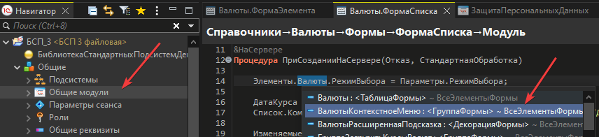
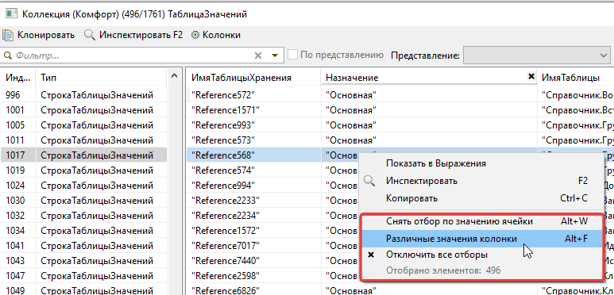
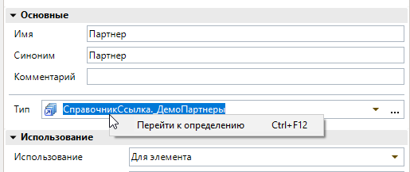
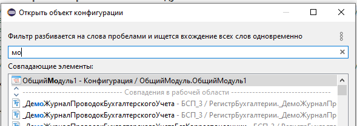

# Общие механизмы
Возможности Комфорт, которые работают **в нескольких окнах** EDT или **глобально**. Специфика конкретного окна — в соответствующем файле. Функции **редакторов текста** — [Редакторы текста](redaktory-teksta.md).
## Фильтры по подстроке в списках :id=filtry-po-podstroke-v-spiskah
**Настройка:** Параметры → Комфорт → **Улучшать списки**.
Два вида фильтра — какой доступен, зависит от конкретного окна.
**Многословный** — базовый вид, работает везде. Текст фильтра дробится на фрагменты по пробелам; для совпадения требуется вхождение **каждого** фрагмента (с мягким учётом порядка), совпадения подсвечиваются.
**Где работает:** список информационных баз, быстрая схема модуля, [списки автодополнения](avtodopolnenie.md), панели «Последние места» и «Наборы объектов», [панель «Результаты поиска»](rezultaty-poiska.md), списки файлов панелей [«История Git»](git-izmeneniya.md) и «Индексирование Git», диалог **«Настройка объединения модулей»** ([сравнение конфигураций](sravnenie-konfiguracij.md#okna-sravneniya-tekstov)), диалоги **«Установить фильтр по объектам и ролям»** и **«Установить фильтр по правам»** ([редактор объекта метаданных](redaktor-obekta-metadannyh.md#vkladka-prava)), [панель «Структура проекта»](struktura-proekta.md) — и как базовый режим везде, где ниже указан иерархический фильтр.
**Иерархический** — расширяет многословный для списков с уровнями (тип объекта → сам объект). Точка в тексте фильтра (вне кавычек) делит его на **секции** — по одной на уровень. Секции сравниваются с полным именем элемента **с конца**: последняя секция — с именем самого элемента, предыдущая — с именем его родителя, и т. д.
- `Справ.Вал` — секция `Справ` ищется у родителя (например, «Справочник»), секция `Вал` — у самого элемента (например, «Валюты»); без точки в фильтре сравнение всегда идёт только с именем самого элемента (родитель не проверяется). Найденные фрагменты подсвечиваются на каждом уровне, где нашлась своя секция.
- `"Справ.Вал"` (в кавычках) — точная фраза целиком, точка внутри кавычек секции не образует.
- Кавычками можно «спрятать» и пробел внутри одного фрагмента: `"их вал"` ищется как одна фраза, а не как два отдельных слова.
- Найденный элемент, если дерево свёрнуто, раскрывается автоматически.

**Где работает:** [панель «Навигатор»](navigator.md), [панель «Структура проекта»](struktura-proekta.md), [диалог выбора объекта](dialog-vybora-obekta.md), [диалог выбора типа](dialog-vybora-tipa.md) (включая поле «Тип» в мастере «Новый реквизит» и панели «Свойства») ([#146](https://github.com/tormozit/EDT.Comfort/issues/146), [#147](https://github.com/tormozit/EDT.Comfort/issues/147)), окно **«Сравнение ролей»** ([#185](https://github.com/tormozit/EDT.Comfort/issues/185)), вкладка **Права** и окно **«Все роли»** [редактора объекта метаданных](redaktor-obekta-metadannyh.md).

**Клавиши в поле фильтра** (фокус остаётся в поле ввода):

| Клавиши | Действие |
|---------|----------|
| ↓ / ↑ / PgDn / PgUp | Перемещение по строкам связанного списка или дерева |
| Enter | Основное действие по текущей строке (открыть, выбрать) |
| Ctrl+↓ | История прошлых запросов; Enter применяет выделенный пункт |

История запросов сохраняется между открытиями окна.

В тёмной теме EDT выделение строки в списках сделано заметнее:

Исправлены цвета общего универсального табличного поля (используется, например, в таблице результатов поиска по дереву сравнения) в тёмной теме ([#226](https://github.com/tormozit/EDT.Comfort/issues/226)).
Восстановлена подсветка текущей строки в выпадающих списках EDT 2025–2026 (поля выбора значения в панели «Свойства», редакторах объектов метаданных и др.) — в светлой теме штатный список подсвечивал строку только в модели, но не на экране; длинный список также прокручивается колесом мыши ([#142](https://github.com/tormozit/EDT.Comfort/issues/142)).
> **Примечание:** при переключении флажка **Улучшать списки** большинство механизмов реагируют сразу. Доработка поля **«Тип»** применяется только при следующем старте EDT. Подробнее — [Улучшать списки](uluchshenie-spiskov.md).
## Копирование из списков (Ctrl+C) :id=kopirovanie-iz-spiskov
Если у списка (таблица или дерево) нет штатной команды копирования, **Ctrl+C** копирует текст активной ячейки (или представление текущей строки) в буфер обмена ([#181](https://github.com/tormozit/EDT.Comfort/issues/181)).
## Отбор по значению колонки :id=otbor-po-znacheniyu-kolonki
Быстрый отбор строк по содержимому ячейки — как в табличном поле 1С ([#266](https://github.com/tormozit/EDT.Comfort/issues/266)). Работает в таблицах и деревьях, доработанных Комфорт: [«Индексирование Git»](git-izmeneniya.md) и [«История»](git-izmeneniya.md), [«Результаты поиска»](rezultaty-poiska.md), [окно «Коллекция»](okno-kollektsii.md), [«Наборы объектов»](nabory-obektov.md), [«Последние места»](poslednie-mesta.md), [«Трассировка стека»](trassirovka-steka.md) и другие окна плагина.
Команды — в **корне** контекстного меню списка (не в подменю «Комфорт»), отдельной группой:

| Команда | Клавиши | Описание |
|---------|---------|----------|
| **Отобрать по значению ячейки** | Alt+W | Оставить строки, у которых в активной колонке то же значение, что в активной ячейке |
| **Снять отбор по значению ячейки** | Alt+W | Тот же пункт на уже отобранной колонке — снимает её отбор |
| **Различные значения колонки** | Alt+F | Окно со списком различных значений активной колонки и числом строк по каждому; выбор строки сразу накладывает отбор |
| **Отключить все отборы** | — | Снимает отборы по всем колонкам; подсказка пункта перечисляет активные отборы |
| **Отобрано элементов: N** | — | Информационная строка с числом отобранных элементов |

- Отборы по **разным колонкам** объединяются по «И».
- Отбор по колонке сочетается с [фильтром по подстроке](#filtry-po-podstroke-v-spiskah), если он есть в этом окне: строка должна пройти оба условия.
- В окне **«Различные значения колонки»** есть своё поле фильтра по подстроке с подсветкой вхождений и флажок **«Учитывать отбор»**: при включённом флажке значения считаются только по строкам, прошедшим остальные отборы (рядом показано их описание), при снятом — по всем строкам.
- Активная колонка — та, в которой сделан последний щелчок (её заголовок помечен акцентной полоской); у колонок с отбором в заголовке появляется значок **×**.

Пример — [окно «Коллекция»](okno-kollektsii.md):

## Порядок и ширина колонок :id=poryadok-i-shirina-kolonok
Для таблиц Комфорт:
- Колонки можно **переставлять** перетаскиванием заголовка; порядок и ширины запоминаются между открытиями окна.
- **Заполнение по ширине** — если колонки умещаются в таблицу, они растягиваются на всю её ширину, а при изменении размера окна режим сохраняется (аналог табличного поля 1С) ([#266](https://github.com/tormozit/EDT.Comfort/issues/266)). Если ширины были подобраны вручную и оставлен запас свободного места, режим сам не включается.

Общее поведение ширин колонок — и в таблицах Комфорт, и в перечисленных ниже штатных списках:
- **Перетаскивание границы** колонки ужимает колонки правее, поэтому горизонтальная прокрутка не появляется. С зажатым **Ctrl** соседние колонки не трогаются — колонка расширяется за границу списка вместе с прокруткой.
- Уже минимальной ширины (около двух символов текущего шрифта) колонка не сужается.
- Ширины, подобранные вручную с переполнением, сохраняются: авто-заполнение их обратно не схлопывает.
- В списках с **общими колонками** (например, «Индексированные изменения» и «Неиндексированные изменения» в панели [Индексирование Git](git-izmeneniya.md)) подгонка идёт под общую ширину — с запасом на вертикальную прокрутку, если она есть хотя бы в одном из списков.

Где работает, кроме таблиц Комфорт ([#273](https://github.com/tormozit/EDT.Comfort/issues/273)): [инспектор переменных](inspektor-peremennyh.md) (отдельное окно и hover), представления [Выражения и Выражения встроенного языка](predstavleniya-otladki.md), панель [Индексирование Git](git-izmeneniya.md). В штатных списках EDT ширины колонок задаются один раз при построении и с окном не меняются — плагин это исправляет.
## Копирование ссылки :id=kopirovanie-ssylki
**Клавиши:** Ctrl+F11 (приоритет над локальными привязками EDT)  
**Панель:** **Ссылка**
Копирует в буфер ссылку на объект метаданных, модуль или строку кода.
## Перетаскивание из навигатора в списки :id=peretaskivanie-iz-navigatora
Перетаскивание объекта метаданных из [навигатора](navigator.md) на список с **неизменяемым составом** (нельзя добавить строку сбросом) подставляет иерархическое имя в поле поиска этого списка и отфильтровывает его. Для реквизита это `Реквизит.Бик`, а не голое `Бик`; для объекта метаданных — `Справочник.Организации`.
Так можно найти реквизит, форму, объект на странице **Права** роли или объекта, в окне **Все роли**, строку в диалоге выбора и в других списках метаданных, где над таблицей или деревом есть поле **«Поиск…»**.
В [сравнении конфигураций](sravnenie-konfiguracij.md) сброс на дерево не фильтрует, а **выделяет** соответствующую строку.
Списки, куда сброс **добавляет** элементы ([наборы объектов](nabory-obektov.md)), работают по-прежнему.
## Переход к определению :id=perehod-k-opredeleniyu
**Клавиши:** Ctrl+F12 (приоритет над EDT, в т.ч. в редакторе форм)
Переход к объявлению символа, объекту метаданных или строке модуля. При подключённом ИР может использовать его механизмы.
Команда **«Перейти к определению»** также доступна в контекстном меню **всех полей ввода**, содержащих ссылки на метаданные ([#144](https://github.com/tormozit/EDT.Comfort/issues/144)):

## Переход по ссылке :id=perehod-po-ssylke
**Панель:** **Перейти**
Читает ссылку из буфера обмена и открывает соответствующее место в EDT.
## Показать в навигаторе (редактор XML) :id=pokazat-v-navigatore-xml
В контекстном меню редактора XML (страница **Source**, в т.ч. открытый как обычный текстовый файл `.xml`) — подменю **Комфорт** с командой **«Показать в навигаторе»**: выделяет соответствующий объект метаданных в [навигаторе](navigator.md) ([#220](https://github.com/tormozit/EDT.Comfort/issues/220)).
Там же — переключатель **«Подсказки при наведении без Ctrl»**: тот же, что в [редакторе модуля](redaktor-modulya.md). Выключенный режим требует зажатый Ctrl и в XML.
## Индикатор фоновых заданий :id=indikator-fonovyh-zadanij
Узкий индикатор в строке состояния EDT (рядом с индикатором «1С:Напарник») дополнен счётчиком активных заданий и процентами остальных: `N. Имя задачи NN%, п1%, п2%…` — вместо штатного отображения только одной задачи ([#216](https://github.com/tormozit/EDT.Comfort/issues/216)).
## История значений полей конфигурации запуска :id=istoriya-polej-konfiguracii-zapuska
На вкладке **«Аргументы»** диалога конфигураций запуска у текстовых полей (**разделение данных**, **параметр запуска**, **файл журнала**, **имя PWA**) появляется кнопка **▾** с историей ранее введённых значений; то же по **Ctrl+↓** в поле ([#259](https://github.com/tormozit/EDT.Comfort/issues/259)). У каждого поля своя история, она сохраняется между запусками EDT.
## Кнопка «Ссылки» в окне ошибки :id=knopka-ssylki-v-okne-oshibki
В окно **«Ошибка»** EDT (а также в штатные окна ошибок платформы Eclipse) добавлена кнопка **«Ссылки»**: из текста ошибки извлекаются пути объектов метаданных — в том числе файлы выгрузки конфигурации вида `/CommonModules/Имя.xml` — и открывается список найденных объектов; выбор строки открывает объект в EDT ([#263](https://github.com/tormozit/EDT.Comfort/issues/263)). Кнопка недоступна, если в тексте ошибки не распознан ни один путь.
## Уведомление о завершении длительных операций :id=uvedomlenie-o-zavershenii-dlitelnyh-operacij
Если операция EDT завершилась успешно, а пользователь, скорее всего, на неё не смотрит (окно EDT без фокуса ОС либо не было действий мышью и клавиатурой 30 секунд и более), показывается «липкое» уведомление: **«Завершено: <операция> [проект] в ЧЧ:ММ:СС за <длительность>»** ([#111](https://github.com/tormozit/EDT.Comfort/issues/111)). В уведомлении есть ссылка **«Активировать окно»**. Пока указатель не наводили на уведомление, оно не скрывается само (слева от крестика — знак бесконечности); при наведении знак сменяется обратным отсчётом секунд, после ухода указателя уведомление скрывается как обычное. Закрыть можно и крестиком. Тот же отсчёт секунд слева от крестика есть у всех уведомлений Комфорт.
Отслеживаются: загрузка конфигурации, сравнение конфигураций, объединение (слияние) конфигураций, выгрузка конфигурации в файлы XML, активация проектного контекста, переключение на ветку Git (команда **«Извлечь»**) — в тексте указывается имя ветки, отправка на сервер Git — в тексте указывается назначение.
Операции короче 3 секунд уведомление не вызывают, но только если они стартовали, когда окно EDT не было на переднем плане: то, что пользователь запустил сам, находясь в EDT, он ждёт — о таком сообщается независимо от длительности.
Отдельно отслеживаются ошибки: если сама операция записала в журнал ошибок хотя бы одну ошибку, уведомление показывается всегда — независимо от фокуса окна, действий пользователя, длительности операции и её итогового статуса. Текст — **«Завершено с ошибками (N): <операция> …»**, ссылка — **«Открыть журнал ошибок»**: активирует окно EDT, открывает журнал и выделяет в нём строку первой из подсчитанных ошибок.
При ошибке **отправки на сервер Git** уведомление **«Завершено с ошибкой: Отправка на сервер Git …»** показывается всегда, если штатный диалог **«Результаты отправки»** не появился. Если диалог уже на экране и окно EDT (включая этот диалог) на переднем плане, отдельное уведомление не дублирует его ([#340](https://github.com/tormozit/EDT.Comfort/issues/340)).
Если во время отслеживаемой операции появляется модальное окно, ждущее решения пользователя (например «Реорганизация информации» при обновлении конфигурации базы), показывается уведомление **«Требуется решение пользователя: <название задачи>»** со ссылкой **«Активировать окно»** — она выводит на передний план и EDT, и само это окно. Уведомление закрывается, когда окно закрыто. Окна прогресса, где нет кнопок кроме «Отмена», уведомление не вызывают.
## Открыть объект конфигурации :id=otkryt-obekt-konfiguracii
**Клавиши:** Ctrl+2 (контекст «В окнах»)
Диалог выбора объекта метаданных — аналог штатной команды EDT; сочетание настраивается в **Параметры → Общие → Клавиши**, контекст **В окнах**.
Если в момент вызова в активном текстовом поле выделен фрагмент **без переводов строк** и **короче 100 символов**, он подставляется в поле поиска диалога ([#116](https://github.com/tormozit/EDT.Comfort/issues/116)).
При пустом фильтре список последних объектов упорядочен по моменту открытия (новые сверху); при непустом — совпадения из последних остаются секцией сверху ([#288](https://github.com/tormozit/EDT.Comfort/issues/288)).

## Перейти к родителю в дереве :id=perejti-k-roditelju-v-dereve
**Клавиши:** Ctrl+Up (глобально, по умолчанию)
Выбирает **родительский** элемент текущего выделения в дереве с фокусом — в навигаторе, структуре проекта, сравнении конфигураций и других представлениях с деревом SWT. Аналог поведения конфигуратора 1С ([#83](https://github.com/tormozit/EDT.Comfort/issues/83)).
## Разворачивание и сворачивание поддерева :id=razvorachivanie-poddereva
**Клавиши:** Ctrl+клик по значку разворота (плюсик или минус слева от текста первой колонки).
Во **всех** деревьях EDT разворачивает или сворачивает **всё поддерево** кликнутой строки — всех потомков, а не один уровень ([#10](https://github.com/tormozit/EDT.Comfort/issues/10)).
В [сравнении конфигураций](sravnenie-konfiguracij.md) разворот поддерева идёт командой **Развернуть → До измененных** (без добавленных и удалённых узлов). Сворот — как в остальных деревьях.
## Свернуть все другие :id=svernut-vse-drugie
Сворачивает все ветки дерева, **кроме цепочки родителей** текущего выделения (сам выделенный узел, если был развёрнут, тоже сворачивается). Цепочка до выделения остаётся видимой.
**Где доступно:** контекстное меню → **Комфорт** во всех деревьях, где это подменю уже есть: [навигатор](navigator.md), [структура проекта](struktura-proekta.md), [информационные базы](informacionnye-bazy.md), [приложения](prilozheniya.md), [результаты поиска по файлам](rezultaty-poiska.md), деревья [Git](git-izmeneniya.md) (если список файлов — дерево); а также в корне контекстного меню дерева [сравнения конфигураций](sravnenie-konfiguracij.md).
## Найти/Заменить — счётчик совпадений :id=najti-zamenit-schetchik
В штатном диалоге **«Найти/Заменить»** (Ctrl+F в текстовых редакторах и в окнах [сравнения текстов](sravnenie-konfiguracij.md#okna-sravneniya-tekstov)) — **счётчик найденных** в реальном времени: подсчёт идёт в фоне, во время расчёта в статусной строке диалога показывается «Поиск…». Учитываются флажки «С учётом регистра» и «Слово целиком»; поиск начинается при длине строки **от 2 символов**. Кнопка «Выбрать всё» переименована в **«Выделить все»** ([#206](https://github.com/tormozit/EDT.Comfort/issues/206)).
Подробнее — [Редакторы текста → Найти/Заменить](redaktory-teksta.md#najti-zamenit).
## Вставить со сравнением
**Клавиши:** Ctrl+Alt+V (контекст «В окнах»; срабатывает при фокусе в редактируемом текстовом поле)
Сравнение выделенного фрагмента с буфером обмена и вставка отредактированного текста.
Полное описание — [Редакторы текста → Вставить со сравнением](redaktory-teksta.md#vstavka-so-sravneniem).
## Сортировать строки текста
**Клавиши:** не назначены по умолчанию (контекст «В окнах»; срабатывает при фокусе в редактируемом текстовом поле)
Сортировка выделенных строк текста по алфавиту.
Полное описание — [Редакторы текста → Сортировать строки текста](redaktory-teksta.md#sortirovat-stroki-teksta).
## Автодополнение
Улучшает контекстную подсказку в **редакторе BSL**: умный фильтр, автооткрытие при вводе, при подключённом [приложении ИР](#integraciya-s-ir) — дополнительные варианты и HTML-описания (в т.ч. в строковых литералах).
**Настройки:** **Улучшать списки** (обязательна) и группа **Редактор кода** в [Параметрах](nastroyki.md).
Полное описание — [Автодополнение](avtodopolnenie.md).
## Команды ИР в редакторе BSL :id=komandy-ir-v-redaktore-bsl
Активны **только при подключённом приложении ИР**. Сочетания — в контексте **Редактирование источника Xtext** (см. [Горячие клавиши](goryachie-klavishi.md)):
| Команда | Назначение |
|---------|------------|
| Вложенный текст ИР | Редактирование строкового литерала в редакторе текста ИР |
| Конструктор запроса ИР | Конструктор запроса ИР из модуля или редактора запроса ([#180](https://github.com/tormozit/EDT.Comfort/issues/180)) |
| Конструктор метода ИР | Создание/редактирование метода через ИР |
| Найти ссылки ИР | Поиск ссылок на символ через ИР ([#86](https://github.com/tormozit/EDT.Comfort/issues/86)) |
| Объявить тип выражения ИР | Объявление типа выражения через ИР ([#164](https://github.com/tormozit/EDT.Comfort/issues/164)) |
| Очистить ошибки ИР | Удаление ранее загруженных ошибок ИР из ошибок конфигурации ([#166](https://github.com/tormozit/EDT.Comfort/issues/166)) |
| Отладить объект ИР | см. [Отладить объект ИР](#otladit-obekt-ir) |
| Проверить модуль ИР | Передача модуля на проверку в ИР ([#138](https://github.com/tormozit/EDT.Comfort/issues/138)); загрузка ошибок в ошибки конфигурации ([#166](https://github.com/tormozit/EDT.Comfort/issues/166)) |
| Форматировать текст ИР | Форматирование выделения через ИР |
## Отладить объект ИР :id=otladit-obekt-ir
Выражение или значение передаётся в отладочный инструмент **ИР** — открывается окно приложения ИР или окно отлаживаемого клиента 1С. Горячих клавиш нет, только контекстное меню.
### Где доступна
| Контекст | Как вызвать | Что передаётся |
|----------|-------------|----------------|
| Редактор BSL | Контекстное меню (корневой уровень, не подменю «Комфорт») | Выделенный фрагмент или выражение под курсором в контексте текущей строки модуля |
| **Переменные** | Контекстное меню, одна выбранная переменная | Значение переменной как выражение отладки |
| **Выражения** | Контекстное меню, одно выбранное выражение | Текст выражения из списка |
| **Параметры точки останова** | Команда «Выводить ИР» ([#136](https://github.com/tormozit/EDT.Comfort/issues/136)) | Настройка вывода ИР при срабатывании точки останова |
Подробнее по контекстам: [Редактор модуля](redaktor-modulya.md), [Переменные и выражения](predstavleniya-otladki.md).
### Условия
- Подключено [приложение ИР](#integraciya-s-ir).
- **Отладка на паузе** (остановка на точке останова) для проекта текущей сессии.
- Для редактора BSL пункт виден только при остановке в модуле этого проекта.

### Поведение

1. Модуль синхронизируется с сеансом ИР (как при других командах ИР).
2. ИР разбирает контекст текущей строки или выражения и формирует вызов отладки.
3. EDT вычисляет выражение в контексте текущего кадра стека отладки.
4. Результат открывается в ИР или активируется окно **толстого клиента** (если отладка идёт через клиентское приложение).

### Особые случаи

- **Многострочное логическое выражение** (начинается с `Истина` / `Ложь`) — в ИР открывается **расшифровка** выражения в текстовом редакторе, а не стандартная отладка объекта.
- **Отложенная отладка** — если результат содержит предложение «открыть объект для отладки», ИР открывает отложенный объект.
- Если снимок объекта **не успел появиться** — уведомление с просьбой повторить команду или активировать окно отлаживаемого приложения.

### Отличие от инспектора (F9)

[Инспектор переменных](inspektor-peremennyh.md) показывает значение в EDT или hover. **Отладить объект ИР** передаёт задачу в **Инструменты разработчика** для углублённой отладки (исследователь, консоль и т.п.).

**Ограничения:** Windows, COM, ИР в базе — см. [Известные ограничения](izvestnye-ogranicheniya.md).

## Интеграция с ИР :id=integraciya-s-ir
Автоматическое подключение служебного клиентского приложения текущей базы 1С (COM). Требуются установленные ИР в базе; при первой регистрации COM может понадобиться запуск EDT от администратора.
Настройки на базу — в [Панель «Приложения»](prilozheniya.md) и [Синхронизация базы](sinhronizaciya-bazy.md).
### Редактор ИР для макетов
При подключённом ИР доступна команда **Редактор ИР** для редактирования в приложении ИР с последующим возвратом в EDT:
| Объект | Где вызвать | Справка |
|--------|-------------|---------|
| Табличный документ | Контекстное меню вкладки **Табличный документ** | [Редактор табличного документа](redaktor-tablichnogo-dokumenta.md) |
| Схема компоновки данных | Кнопка на панели вкладки **Макет** (СКД) | [Схема компоновки данных](skhema-komponovki-dannyh.md) |
Возврат изменений — через штатный переход из ИР в EDT ([Переход к определению](#perehod-k-opredeleniyu)). Не редактируйте тот же объект одновременно в обеих средах.
## Улучшения окон отладчика :id=uluchsheniya-okon-otladchika
**Настройка:** Параметры → Комфорт → **Улучшать окна отладчика**.
Включает доработки инспектора, переменных, выражений и окна «Коллекция» (см. [Инспектор переменных](inspektor-peremennyh.md), [Представления отладки](predstavleniya-otladki.md), [Окно «Коллекция»](okno-kollektsii.md)). При выключении горячие клавиши в этих окнах не перехватываются; пункты меню и окно коллекции остаются.
## Панель инструментов EDT
| Кнопка | Действие |
|--------|----------|
| **Перейти** | [Переход по ссылке](#perehod-po-ssylke) |
| **Ссылка** | [Копирование ссылки](#kopirovanie-ssylki) |
| **Последние** | Открыть панель [Последние места](poslednie-mesta.md) |
## Настройка клавиш
Команды категории **Комфорт** — в **Параметры → Общие → Клавиши**. На странице **Параметры → Комфорт** есть ссылка с фильтром по категории.
**Важно:** для глобальных команд (Ctrl+F11, Ctrl+F12 и др.) рекомендуется менять сочетания только в контексте **«В окнах»**, как указано в описаниях команд в EDT.
## Автоматические функции
Поведение без явной команды: фокус в поле фильтра при открытии диалогов выбора, уведомления при проблемах ИР, подсказки в строке состояния для пунктов меню Комфорт и др. — по мере развития плагина перечень дополняется в [релизах](https://github.com/tormozit/EDT.Comfort/releases).
