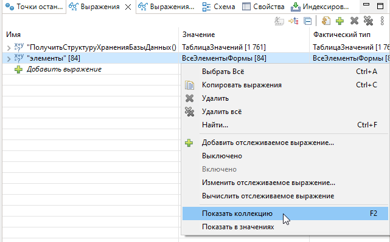
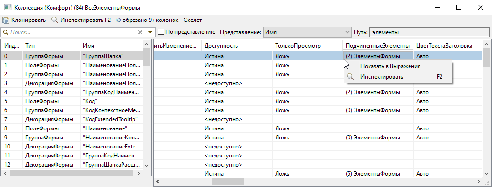

# Окно «Коллекция»

Отдельное окно для просмотра таблиц, списков, структур и других коллекций при отладке.

## Как открыть

- **F2** — «Показать коллекцию» в [Переменных / Выражениях](predstavleniya-otladki.md) или [инспекторе](inspektor-peremennyh.md).
- Контекстное меню переменной или выражения.

## Структура окна

- **Split-таблица:** слева фиксированная часть (колонки «Индекс» и «Представление»), справа — прокручиваемые колонки данных; границу можно перетаскивать.
- **Путь** — полный путь к коллекции на сервере отладки.
- **Фильтр** — отбор строк по подстроке; флажок **По представлению** ограничивает поиск колонкой представления.
- **Представление** — выбор колонки, используемой как «Представление» в фиксированной части (справа от «Индекс»).

## Панель инструментов

| Действие | Описание |
|----------|----------|
| **Инспектировать** | F2 — открыть выбранный элемент в [инспекторе](inspektor-peremennyh.md) |
| **Клонировать** | Открыть копию окна с тем же содержимым без повторной загрузки с сервера отладки |
| **⚙ Колонки** | Настройка видимости и порядка колонок |
| **Копировать** | Ctrl+C — текст **активной ячейки** |
| **Скелет** | Тестовая таблица без сервера отладки (см. ниже) |

## Контекстное меню

- **Инспектировать** (F2).
- **Добавить в «Выражения»** — добавить элемент в панель выражений отладки.

## Диалог «Колонки»

- Отметьте видимые колонки; **Вверх** / **Вниз** меняют порядок; **По алфавиту** сортирует список.
- Двойной щелчок по строке активирует колонку в таблице.
- **Ctrl+F** — поиск по списку колонок.
- Настройки запоминаются в привязке к пути и типу коллекции до конца сессии EDT.

## Поиск по таблице

- **Ctrl+F** — открыть поиск по содержимому таблицы.
- **F3** / **Shift+F3** — следующее / предыдущее совпадение.

## Поведение таблицы

- Клик в **любой** колонке выделяет строку и активную ячейку.
- Подсветка выбранной строки и активной ячейки; под заголовком активной колонки — акцентная полоска.

## Настройка

Горячие клавиши настраиваются в **Клавиши → Комфорт**. При выключенном **Улучшать окна отладчика** перехват F2 в отладке отключается; меню «Показать коллекцию» остаётся.

## Тест

Команда **Открыть скелет коллекции** (Ctrl+Shift+Alt+K) — таблица 1000×50 без сервера отладки. Кнопка **Скелет** в окне коллекции открывает аналогичную тестовую таблицу 1000×100.

## Иллюстрации

Ускоренное заполнение больших коллекций:

