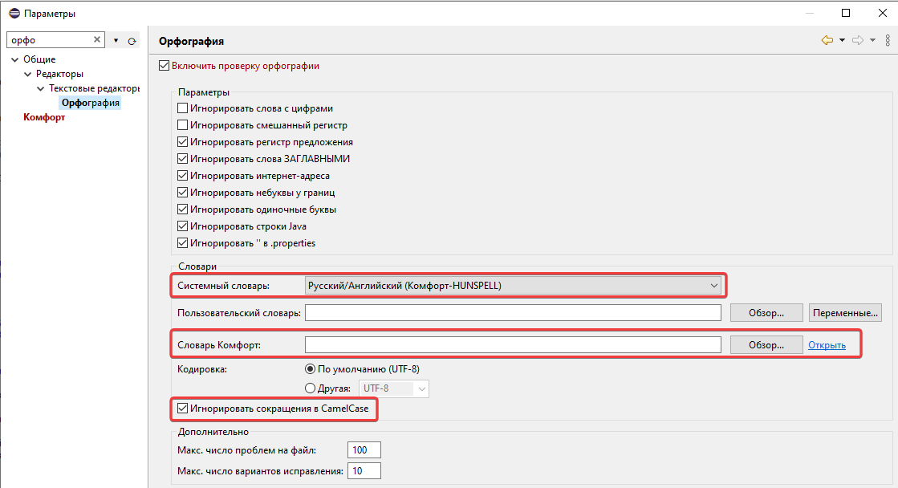
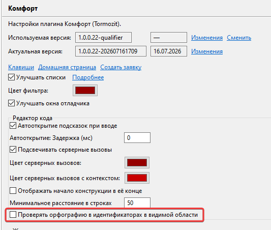
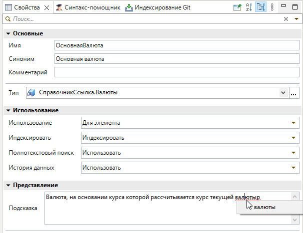
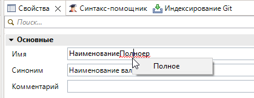
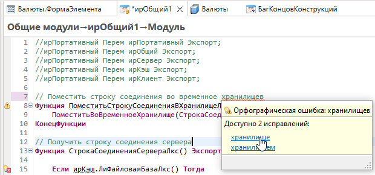
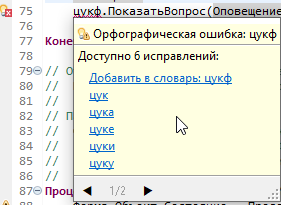
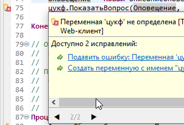
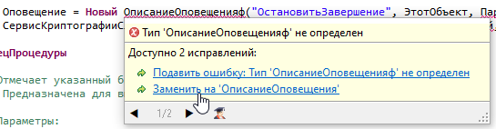
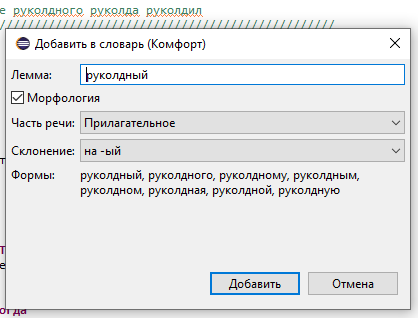
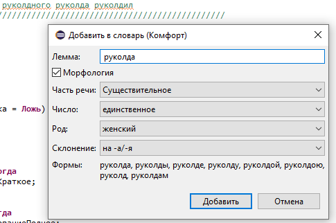

# Орфография

Проверка орфографии в редакторе кода и связанных полях на основе словарей **HUNSPELL** (русский и английский) ([#175](https://github.com/tormozit/EDT.Comfort/issues/175)).

## Подключение словарей

При **первом старте** плагин подключает поставляемые словари HUNSPELL для русского и английского языков и выставляет рекомендуемые настройки орфографии EDT. Штатная страница **Параметры → Общие → Орфография** переведена на русский.

Пользовательский словарь разделён на **локальный** (рабочая станция) и **проектный** (хранится с проектом). Добавление слова — через диалог **«Добавить в словарь»** или быстрые исправления.

## Разбор идентификаторов

В отличие от штатного токенизатора, слова со смешанным регистром разбиваются на подслова по границам **CamelCase** (заглавные буквы).

| Параметр | Где | Описание |
|----------|-----|----------|
| Проверять орфографию в идентификаторах в видимой области | **Параметры → Комфорт → Редактор кода** | Проверка имён в видимой части редактора |
| Игнорировать сокращения в CamelCase | **Параметры → Общие → Орфография** | Короткие фрагменты вроде аббревиатур в CamelCase не помечаются (включён по умолчанию) |

В панели **«Свойства»** проверка текста в поле ввода выполняется при получении полем фокуса.

## Подсказки и быстрые исправления

На ошибочном слове доступны подсказки с вариантами замены и переключением между маркерами. Быстрые исправления предлагают замены на расстоянии редактирования **1** ([#176](https://github.com/tormozit/EDT.Comfort/issues/176)).

Подсказки нескольких маркеров (переключение страницами в подсказке):

Диалог **«Добавить в словарь»** — с морфологией (формы слова по части речи и склонению):

## См. также

- [Редактор модуля](redaktor-modulya.md)
- [Настройки](nastroyki.md)
