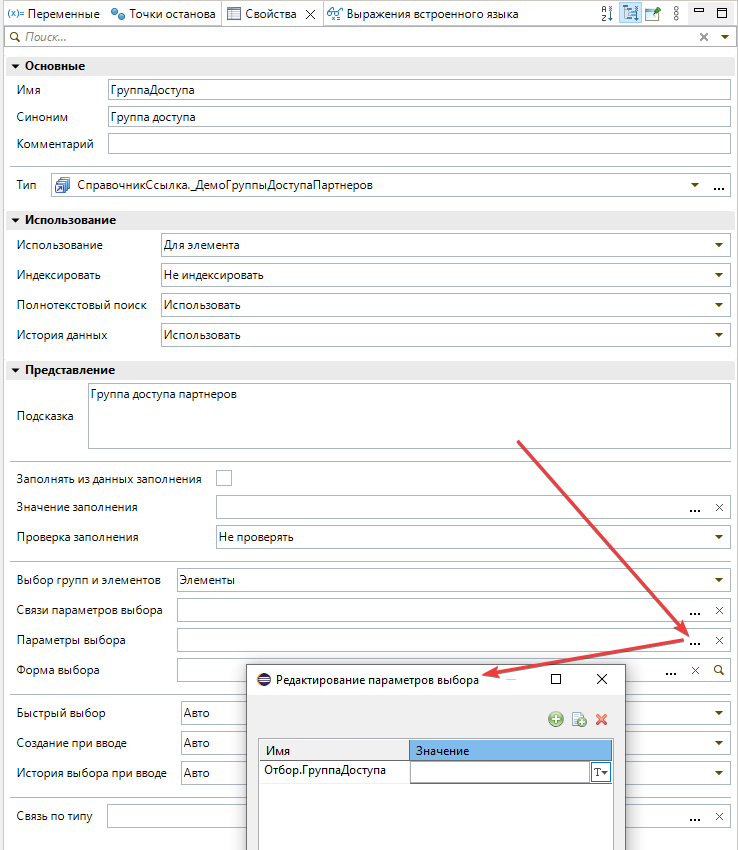

# Параметры выбора

Диалог **Редактирование параметров выбора** (составные типы, поля отбора).

## Автовыбор типа значения

При выборе **имени параметра** (колонка «Имя», значения вида `Отбор.*` / `Filter.*`) Комфорт **автоматически выставляет тип значения** в колонке «Значение» по метаданным поля отбора.

## Подбор имени связи параметров выбора

При добавлении связи параметров выбора Комфорт выбирает первый элемент отбора с тем же описанием типа, что у исходного реквизита. Поиск идёт в порядке доступных имён; сравниваются состав типов и их квалификаторы. Если подходящего элемента нет, сохраняется штатный выбор EDT. Уже добавленные связи не меняются.

См. [Общие механизмы](obshchie-mekhanizmy.md).
