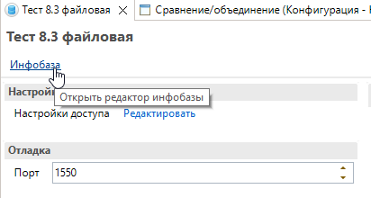

# Панель Приложения

- Подключение и управление приложением **ИР**
- Команда **«Показать приложение ИР»** — переключение на окно подключённого приложения ИР ([#154](https://github.com/tormozit/EDT.Comfort/issues/154))
- Настройки **автоподключения** к базе (колонка **«Авто ИР»**) ([#152](https://github.com/tormozit/EDT.Comfort/issues/152))
- Колонка **«Динамическое обновление»** — автоматический выбор **«Обновить динамически»** при блокировке базы, если к ней подключено ИР (см. [Синхронизация базы](sinhronizaciya-bazy.md))
- Дополнительные колонки и команды в списке

См. [Интеграция с ИР](obshchie-mekhanizmy.md#integraciya-s-ir), [Синхронизация базы](sinhronizaciya-bazy.md).
