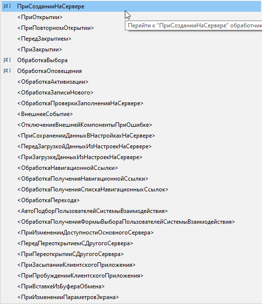

# Редактор формы

Визуальный редактор форм и дерево реквизитов (**Объект.*** ).

## Возможности Комфорт

- **Ctrl+T** — показать объект-владелец выбранного поля «Объект.*» в [навигаторе](navigator.md) (контекст дерева реквизитов формы).
- Дополнения контекстного меню редактора формы.

## Двойной щелчок

- **Визуальный редактор** (область макета формы) — двойной щелчок по элементу выполняет штатные действия редактора формы EDT.
- **Дерево реквизитов** — двойной щелчок по полю метаданных (**Объект.*** и стандартные реквизиты) открывает панель **Свойства** для соответствующего реквизита (без лишнего шага «Изменить»).

## Подменю «События»

Порядок пунктов в подменю **События** контекстного меню формы приведён к стандартному (как в конфигураторе):

См. [Общие механизмы](obshchie-mekhanizmy.md).
