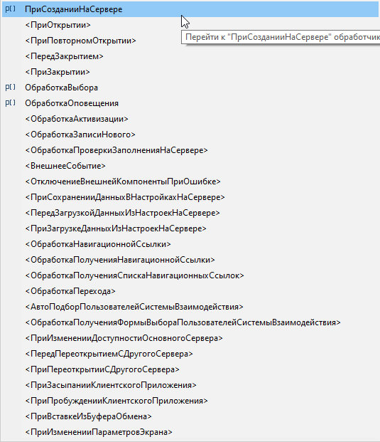

# Редактор формы

## Возможности Комфорт

- **Ctrl+T** — показать объект-владелец выбранного поля «Объект.*» в [навигаторе](navigator.md) (контекст дерева реквизитов формы).
- Дополнения контекстного меню редактора формы.

## Двойной щелчок

- **Визуальный редактор** (область макета формы) — двойной щелчок по элементу выполняет штатные действия редактора формы EDT.
- **Дерево реквизитов** — двойной щелчок по полю метаданных (**Объект.*** и стандартные реквизиты) открывает панель **Свойства** для соответствующего реквизита (без лишнего шага «Изменить»).

## Клик по заголовку эскиза формы

В визуальном редакторе (WYSIWYG) клик по верхней полосе эскиза — области, не принадлежащей ни одному элементу формы, где штатно ничего не происходит — активирует корневой узел **«Форма»** в дереве элементов и панель **Свойства** ([#231](https://github.com/tormozit/EDT.Comfort/issues/231)).

## Проверка «Битая ссылка на картинку»

Автоматическая проверка форм — ссылка на картинку в элементе формы (например, на общую картинку) указывает на несуществующий объект (картинка удалена или переименована). Такая форма вызывает ошибку при загрузке в конфигуратор. Проблема попадает в панель **«Ошибки конфигурации»**; переход к проблеме открывает владельца ссылки (кнопку, команду формы, декорацию…) в редакторе формы ([#221](https://github.com/tormozit/EDT.Comfort/issues/221)).

## Подменю «События»

Порядок пунктов в подменю **События** контекстного меню формы приведён к стандартному (как в конфигураторе):

См. [Общие механизмы](obshchie-mekhanizmy.md).
