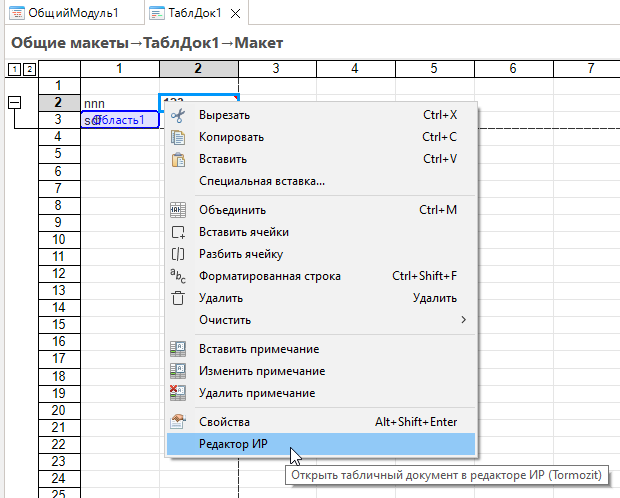

# Редактор макета

Редактор табличного документа (страница **Табличный документ** / **Spreadsheet** в макете объекта метаданных).

## Редактор ИР

Команда **Редактор ИР** открывает текущий макет в табличном редакторе **Инструментов разработчика (ИР)** для редактирования возможностями платформы 1С, недоступными в EDT.

### Как вызвать

1. Откройте макет с табличным документом (`.mxl` / `.xmxl`).
2. Перейдите на вкладку **Табличный документ**.
3. В **контекстном меню** области макета выберите **Редактор ИР**.

### Условия

- Подключено [приложение ИР](obshchie-mekhanizmy.md#integraciya-s-ir) к информационной базе проекта.
- ИР установлены в этой базе.

Без сеанса ИР команда не выполняется.

### Что происходит

1. Комфорт копирует табличный документ в буфер обмена (выделение ячеек в EDT после копирования восстанавливается).
2. В ИР открывается табличный документ с заголовком по ссылке на объект макета.
3. Если перед вызовом была выделена область ячеек, в ИР активируется соответствующая область.

### Возврат изменений в EDT

После редактирования в ИР выполните **переход обратно в EDT** штатной командой ИР (связь через механизм «Перейти к определению» / транспортный каталог ИР↔EDT).

- Если макет **не изменялся в EDT** во время работы в ИР, табличный документ **вставляется из буфера обмена** в открытый редактор макета.
- Если макет был изменён в EDT параллельно — загрузка **не выполняется**; Комфорт покажет уведомление. Резервную копию можно посмотреть в приложении ИР.

> Не редактируйте тот же макет одновременно в EDT и в ИР — иначе изменения из ИР не применятся автоматически.

## Общие механизмы

- [Интеграция с ИР](obshchie-mekhanizmy.md#integraciya-s-ir)
- [Переход к определению](obshchie-mekhanizmy.md#perehod-k-opredeleniyu) — используется при возврате из ИР
