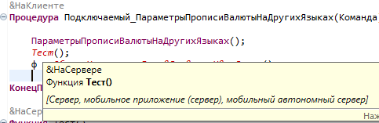

# Редактор модуля

Редактор BSL (модули объектов, форм, общие модули).

## Общие механизмы
<!-- Сортировка по алфавиту (А–Я). При добавлении — вставлять строку на нужную позицию. -->
- [Автодополнение](avtodopolnenie.md)
- [Команды ИР](obshchie-mekhanizmy.md#komandy-ir-v-redaktore-bsl) — конструктор метода, вложенный текст, форматирование, отладка объекта
- [Копирование ссылки](obshchie-mekhanizmy.md#kopirovanie-ssylki) — Ctrl+F11
- [Орфография](orfografiya.md) — проверка HUNSPELL, словарь
- [Переход к определению](obshchie-mekhanizmy.md#perehod-k-opredeleniyu) — Ctrl+F12
- [Текстовые редакторы](redaktory-teksta.md) — быстрый поиск, навигация по идентификатору, вставка со сравнением, контекстное меню

## Команды только в этом окне

| Действие | Клавиши |
|----------|---------|
| Быстрая схема модуля | Ctrl+Ё |
| Вложенный текст ИР | Ctrl+Shift+E |
| Конструктор запроса ИР | Контекстное меню → Комфорт |
| Конструктор метода ИР | Ctrl+Shift+M |
| Найти ссылки ИР | Контекстное меню → Комфорт |
| Объявить тип выражения ИР | Контекстное меню → Комфорт |
| Очистить ошибки ИР | Контекстное меню → Комфорт |
| Проверить модуль ИР | Контекстное меню → Комфорт |
| Форматировать текст ИР | Alt+Shift+F |

## Восстановление позиции

При повторном открытии модуля восстанавливается позиция каретки (и прокрутка) на момент последнего закрытия этого модуля ([#177](https://github.com/tormozit/EDT.Comfort/issues/177)).

## Быстрая схема модуля (Ctrl+Ё)

Окно быстрой схемы дополнено кнопками (при подключённом ИР):

| Кнопка | Назначение |
|--------|------------|
| **Общие ИР** | Список общих методов конфигурации в ИР |
| **Подробно ИР** | Список методов текущего модуля в ИР |

Текст в поле фильтра схемы передаётся как начальный шаблон поиска в списке методов ИР.

## Автодополнение

Автооткрытие и улучшенный фильтр. При подключённом ИР — дополнительные варианты и расширенное описание в боковой панели. В **текстовых литералах** (запросы, пути, произвольный текст в кавычках) подсказка работает вместе с данными ИР.
Полное описание настроек, Ctrl+Space и ограничений — [Автодополнение](avtodopolnenie.md).

## Быстрые исправления имён встроенного языка

При опечатке в имени типа, переменной и других идентификаторах встроенного языка (например лишняя буква в имени типа в конструкторе) предлагается быстрое исправление — замена на близкое правильное имя на расстоянии редактирования **1** ([#176](https://github.com/tormozit/EDT.Comfort/issues/176)).

Это не орфография словаря HUNSPELL — см. [Орфография](orfografiya.md).

## Подсказка по параметрам метода

При вводе `(` или `,` внутри вызова метода автоматически открывается подсказка со списком параметров ([#135](https://github.com/tormozit/EDT.Comfort/issues/135)). Текст подсказки формируется на основе сигнатуры метода и текущего контекста вызова ([#133](https://github.com/tormozit/EDT.Comfort/issues/133)).

## Подсказка начала конструкции {#podskazka-nachala-konstrukcii}

Настройка **Отображать начало конструкции в её конце** (**Параметры → Комфорт → Редактор кода**) — показывает содержимое начала блочной конструкции (`Процедура`/`Функция`, `Если`, `Пока`/`Для`, `Попытка`, `#Область`, `#Если`) полупрозрачным текстом рядом с её закрывающим ключевым словом, когда конструкция занимает много строк ([#80](https://github.com/tormozit/EDT.Comfort/issues/80)).

## Оформление серверных вызовов {#oformlenie-servernyh-vyzovov}

Опция **Серверные вызовы отдельным цветом** ([#66](https://github.com/tormozit/EDT.Comfort/issues/66)) — визуально выделяет серверные вызовы в коде. Настройка: **Параметры → Комфорт → Редактор кода**.

## Hover-подсказка на методе

При наведении на вызов метода в hover-подсказке выводится **директива компиляции** (например, `&НаСервере`) ([#145](https://github.com/tormozit/EDT.Comfort/issues/145)):

## Конструктор метода ИР

## Найти ссылки ИР

Команда **«Найти ссылки ИР»** ([#86](https://github.com/tormozit/EDT.Comfort/issues/86)) — поиск ссылок на выделенный идентификатор через ИР. Доступна в контекстном меню «Комфорт» редактора модуля.

## Проверить модуль ИР

Команда **«Проверить модуль ИР»** ([#138](https://github.com/tormozit/EDT.Comfort/issues/138)) — передача текущего модуля на проверку в ИР. Доступна в контекстном меню «Комфорт» редактора модуля.
Найденные ИР незначительные ошибки (**MINOR**) автоматически загружаются в **ошибки конфигурации** EDT; показывается число добавленных и удалённых. Команда **«Очистить ошибки ИР»** удаляет ранее загруженные ошибки ИР ([#166](https://github.com/tormozit/EDT.Comfort/issues/166)).

## Конструктор запроса ИР

Команда **«Конструктор запроса ИР»** открывает конструктор запроса ИР для текста запроса в модуле или выделенного фрагмента ([#180](https://github.com/tormozit/EDT.Comfort/issues/180)). Контекстное меню → Комфорт.

## Объявить тип выражения ИР

Команда **«Объявить тип выражения ИР»** — объявление типа выделенного выражения через ИР ([#164](https://github.com/tormozit/EDT.Comfort/issues/164)). Контекстное меню → Комфорт.

## Подменю «Окружить»

В штатное подменю EDT **«Окружить»** (контекстное меню редактора BSL) добавлены варианты **Если**, **Для каждого**, **Для по**, **Пока**, **Попытка**, **#Область**, **#Если** — оборачивают выделенный текст (или текущую строку) соответствующей конструкцией ([#129](https://github.com/tormozit/EDT.Comfort/issues/129)).

## Отладить объект ИР

При **остановке отладки** в контекстном меню редактора (корневой уровень, не подменю «Комфорт») доступна команда **Отладить объект ИР**. Имеет смысл **выделить** фрагмент выражения перед вызовом; если выделения нет — берётся контекст под курсором в текущей строке модуля.
Полное описание условий и поведения — в [Общие механизмы → Отладить объект ИР](obshchie-mekhanizmy.md#otladit-obekt-ir).
Запись посещённых методов — в [Последние места](poslednie-mesta.md).
