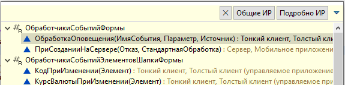
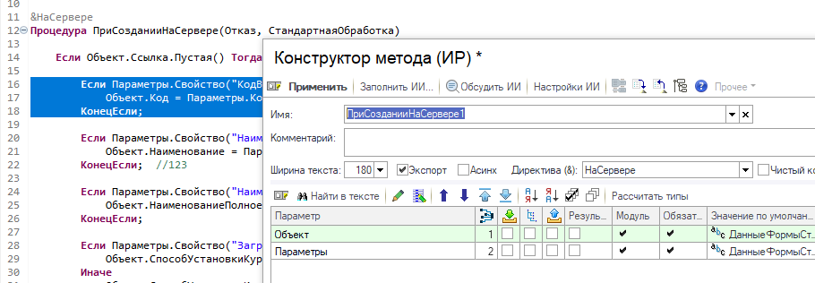

# Редактор модуля

Редактор BSL (модули объектов, форм, общие модули).

## Общие механизмы

<!-- Сортировка по алфавиту (А–Я). При добавлении — вставлять строку на нужную позицию. -->
- [Автодополнение](avtodopolnenie.md)
- [Команды ИР](obshchie-mekhanizmy.md#komandy-ir-v-redaktore-bsl) — конструктор метода, вложенный текст, форматирование, отладка объекта
- [Копирование ссылки](obshchie-mekhanizmy.md#kopirovanie-ssylki) — Ctrl+F11
- [Переход к определению](obshchie-mekhanizmy.md#perehod-k-opredeleniyu) — Ctrl+F12
- [Текстовые редакторы](redaktory-teksta.md) — быстрый поиск, навигация по идентификатору, вставка со сравнением, контекстное меню

## Команды только в этом окне

| Действие | Клавиши |
|----------|---------|
| Быстрая схема модуля | Ctrl+Ё |
| Конструктор метода ИР | Ctrl+Shift+M |
| Вложенный текст ИР | Ctrl+Shift+E |
| Форматировать текст ИР | Alt+Shift+F |
| Найти ссылки ИР | Контекстное меню → Комфорт |
| Проверить модуль ИР | Контекстное меню → Комфорт |

## Быстрая схема модуля (Ctrl+Ё)

Окно быстрой схемы дополнено кнопками (при подключённом ИР):

| Кнопка | Назначение |
|--------|------------|
| **Общие ИР** | Список общих методов конфигурации в ИР |
| **Подробно ИР** | Список методов текущего модуля в ИР |

Текст в поле фильтра схемы передаётся как начальный шаблон поиска в списке методов ИР.

## Автодополнение

Автооткрытие и улучшенный фильтр. При подключённом ИР — дополнительные варианты и расширенное описание в боковой панели. В **текстовых литералах** (запросы, пути, произвольный текст в кавычках) подсказка работает вместе с данными ИР.

Полное описание настроек, Ctrl+Space и ограничений — [Автодополнение](avtodopolnenie.md).

## Конструктор метода ИР

## Найти ссылки ИР

Команда **«Найти ссылки ИР»** ([#86](https://github.com/tormozit/EDT.Comfort/issues/86)) — поиск ссылок на выделенный идентификатор через ИР. Доступна в контекстном меню «Комфорт» редактора модуля.

## Проверить модуль ИР

Команда **«Проверить модуль ИР»** ([#138](https://github.com/tormozit/EDT.Comfort/issues/138)) — передача текущего модуля на проверку в ИР. Доступна в контекстном меню «Комфорт» редактора модуля.

## Подменю «Окружить»

В штатное подменю EDT **«Окружить»** (контекстное меню редактора BSL) добавлены варианты **Если**, **Для каждого**, **Для по**, **Пока**, **Попытка**, **#Область**, **#Если** — оборачивают выделенный текст (или текущую строку) соответствующей конструкцией ([#129](https://github.com/tormozit/EDT.Comfort/issues/129)).

## Отладить объект ИР

При **остановке отладки** в контекстном меню редактора (корневой уровень, не подменю «Комфорт») доступна команда **Отладить объект ИР**. Имеет смысл **выделить** фрагмент выражения перед вызовом; если выделения нет — берётся контекст под курсором в текущей строке модуля.

Полное описание условий и поведения — в [Общие механизмы → Отладить объект ИР](obshchie-mekhanizmy.md#otladit-obekt-ir).

Запись посещённых методов — в [Последние места](poslednie-mesta.md).
