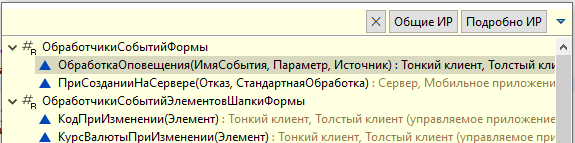
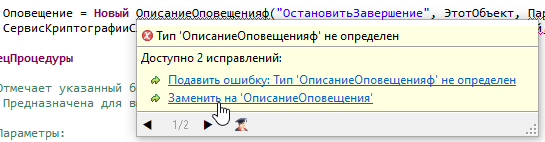
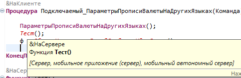
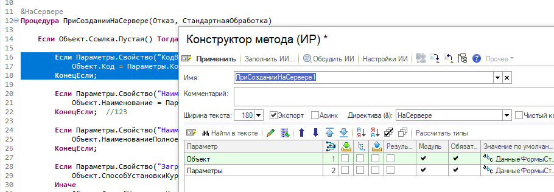

# Редактор модуля
Редактор BSL (модули объектов, форм, общие модули).
## Общие механизмы
<!-- Сортировка по алфавиту (А–Я). При добавлении — вставлять строку на нужную позицию. -->
- [Автодополнение](avtodopolnenie.md)
- [Вертикальная линейка](#vertikalnaya-lineyka) — двойной щелчок по маркеру разворачивает сворачиваемые группы
- [Выделение изменений](#vydelenie-izmenenij) — пробельные отличия Quick Diff скрыты; в тултипе маркера — «Сравнить» и «Откатить»
- [Выделение текущего идентификатора](#vydelenie-tekushchego-identifikatora) — имя с `_` подсвечивается целиком; в модуле из коммита Git так же, как в проекте
- [Иерархия вызовов](ierarhiya-vyzovov.md) — колонки параметров, активация места вызова, отбор и копирование ячейки
- [Команды ИР](obshchie-mekhanizmy.md#komandy-ir-v-redaktore-bsl) — конструктор метода, вложенный текст, форматирование, отладка объекта
- [Копирование ссылки](obshchie-mekhanizmy.md#kopirovanie-ssylki) — Ctrl+F11
- [Напарник](#naparnik) — ручной режим; вставка из чата через сравнение
- [Оформление создаваемых переменных](#oformlenie-sozdavaemyh-peremennyh) — первое присваивание и переменная цикла отдельным цветом
- [Орфография](orfografiya.md) — проверка HUNSPELL, словарь
- [Переход к определению](obshchie-mekhanizmy.md#perehod-k-opredeleniyu) — Ctrl+F12
- [Редакторы текста](redaktory-teksta.md) — быстрый поиск, навигация по идентификатору, вставка со сравнением, контекстное меню

## Команды только в этом окне
| Действие | Клавиши |
|----------|---------|
| Быстрая схема модуля | Ctrl+Ё |
| Вложенный текст ИР | Ctrl+Shift+E |
| Конструктор запроса ИР | Контекстное меню → Комфорт |
| Конструктор метода ИР | Ctrl+Shift+M |
| Найти ссылки ИР | Контекстное меню → Комфорт |
| Объявить тип выражения ИР | Контекстное меню → Комфорт |
| Очистить ошибки ИР | Контекстное меню → Комфорт |
| Проверить модуль ИР | Контекстное меню → Комфорт |
| Сбросить сворачиваемые группы | Ctrl+Shift+Num* |
| Форматировать текст ИР | Alt+Shift+F |
## Восстановление позиции :id=vosstanovlenie-pozicii
При повторном открытии модуля восстанавливается позиция каретки (и прокрутка) на момент последнего закрытия этого модуля ([#177](https://github.com/tormozit/EDT.Comfort/issues/177)).
Устранено неоправданное смещение горизонтальной полосы прокрутки при переходе к месту в модуле — например, из результатов поиска или иерархии вызовов, а также у редакторов, восстановленных при запуске EDT ([#215](https://github.com/tormozit/EDT.Comfort/issues/215)).
## История навигации :id=istoriya-navigacii
Переходы по операторным скобкам (**«Перейти по операторным скобкам вперёд/назад»**, в том числе с выделением) учитываются в истории навигации EDT ([#369](https://github.com/tormozit/EDT.Comfort/issues/369)). После перехода, например от **Для** к **КонецЦикла**, команда **«Назад по истории»** возвращает каретку к исходной строке, а не к объекту, открытому до текущего. Сама EDT такие переходы в историю не записывает.
## Окно рефакторинга
Размер окна мастера рефакторинга (**«Рефакторинг»**, **«Переименовать элемент»** и подобные) запоминается: при следующем открытии окно получает те же ширину и высоту (в пределах размеров экрана). Предпросмотр изменений в этом окне — как в [окнах сравнения текстов](sravnenie-konfiguracij.md#okna-sravneniya-tekstov).

### Пометки вхождений по полнотекстовому поиску :id=pometki-vkhozhdenij-polnotekstovogo-poiska
На странице **«Вносимые изменения»** вхождения старого имени, найденные полнотекстовым поиском (комментарии, строковые литералы, тексты запросов, справка), EDT показывает без пометок — все до одного, даже бесспорные. Комфорт при открытии страницы ставит пометку там, где найдено **полное имя** объекта — имя с типом метаданных перед точкой: `Справочник.Номенклатура`, `Справочники.Номенклатура`, `Catalog.Номенклатура`. Такое вхождение практически всегда и есть ссылка на переименовываемый объект.

Без пометки остаются вхождения, где имя стоит само по себе (`// по номенклатуре считаем итог`) и где оно оказалось частью более длинного имени (`НоменклатураТоваров`). Тип перед точкой на совпадение с видом переименовываемого объекта не проверяется, поэтому при переименовании справочника пометку получит и вхождение вида `Документ.<староеИмя>`.

Пометки расставляются один раз для набора изменений: если снять или добавить их вручную и вернуться на страницу предпросмотра, ручной выбор сохранится. Вхождения в объектах, редактирование которых запрещено (например, на замке поддержки), пометку не получают — это ограничение самой EDT.

### Табличный режим страницы «Вносимые изменения» :id=tablichnyj-rezhim-vnosimyh-izmenenij
Штатно изменения показаны деревом: чтобы понять, что за вхождение в строке, приходится раскрывать узлы и щёлкать по каждому. **Кнопка со значком таблицы** в тулбаре над деревом переключает страницу в табличный режим ([#451](https://github.com/tormozit/EDT.Comfort/issues/451)) — те же изменения плоским списком с колонками. Состояние кнопки запоминается между запусками EDT.

| Колонка | Содержимое |
|---------|------------|
| Изменение | Значок и текст изменения — то же, что видно в дереве |
| Файл | Имя файла, в котором находится вхождение |
| Тип файла | Расширение этого файла |
| Модуль | Путь модуля в терминах 1С (как в поле имени модуля), для остальных файлов пусто |
| Метод | Метод модуля, в котором находится вхождение |
| Родитель | Текст слева от точки, предшествующей вхождению |
| Тип родителя | Тип этого текста, вычисленный по модели встроенного языка |
| Категория | Литерал, комментарий, метод или свойство |

- Строки — те же вхождения, что листья дерева: набор изменений и отборы у режимов общие, поэтому показывают они всегда одно и то же.
- **Пометки** — в первой колонке, то же состояние, что в дереве. Выделять строки можно пачками (Shift, Ctrl); **Пробел** ставит или снимает пометку у всех выделенных строк, то же делают команды контекстного меню **«Установить пометки выделенных»** и **«Снять пометки выделенных»**.
- Колонки **«Метод»**, **«Родитель»**, **«Тип родителя»** и **«Категория»** заполняются только для модулей. Тип родителя требует разбора модуля моделью встроенного языка, поэтому считается в фоне: до расчёта в ячейке стоит `?`, а в заголовке колонки виден счётчик обработанных вхождений. Если тип определить не удалось, `?` остаётся.
- Текущая строка синхронизирована с деревом в обе стороны, панель сравнения снизу показывает изменение текущей строки.
- Сортировка — щелчком по заголовку колонки, есть [отбор по значению ячейки](obshchie-mekhanizmy.md#otbor-po-znacheniyu-kolonki), [Ctrl+C](obshchie-mekhanizmy.md#kopirovanie-iz-spiskov) копирует активную ячейку; [порядок и ширина колонок](obshchie-mekhanizmy.md#poryadok-i-shirina-kolonok) запоминаются между открытиями окна.
## Выделение текущего идентификатора :id=vydelenie-tekushchego-identifikatora
В модуле, открытом из коммита Git (вкладка вида «Module.bsl …»), подсветка текущего идентификатора работает так же, как в редакторе модуля проекта: при каретке на имени подсвечиваются остальные вхождения. Стратегия поиска — **Параметры → Встроенный язык → Выделение текущего идентификатора**.

**Имя с подчёркиванием — целиком.** В стратегии «по совпадению строкового представления» EDT считает `_` границей слова: при каретке в `ОповеститьПользователя_Получатели` подсвечивался не сам этот идентификатор, а хвост `Получатели` — во всех именах, которые им кончаются. Комфорт расширяет имя под кареткой до полного, вместе с `_`, и подсвечиваются вхождения именно его ([#452](https://github.com/tormozit/EDT.Comfort/issues/452)). На выделенный вручную фрагмент это не влияет: там шаблоном подсветки, как и раньше, остаётся сам выделенный текст.
## Сбросить сворачиваемые группы
Команда **«Сбросить сворачиваемые группы»** ([#299](https://github.com/tormozit/EDT.Comfort/issues/299)) возвращает все сворачиваемые группы открытого модуля к состоянию свёрнутости как при открытии — с учётом настроек **Параметры → Встроенный язык → Сворачивание/Отображение участка кода**. Нужна, если группы были свёрнуты или развёрнуты вручную, в том числе командой **«Свернуть все»** (Ctrl+Shift+Num/).
Доступна в контекстном меню **Комфорт** редактора модуля и по Ctrl+Shift+Num* (клавиша «*» на цифровой клавиатуре). Сочетание можно изменить в **Параметры → Клавиши**, контекст **Контекст редактора встроенного языка**.
## Вертикальная линейка :id=vertikalnaya-lineyka
Двойной щелчок по маркеру на **линейке обзора** (цветная полоса справа от текста) разворачивает все сворачиваемые группы, которые скрывают строки этого маркера, и переходит к ним ([#308](https://github.com/tormozit/EDT.Comfort/issues/308)). Одинарный щелчок по-прежнему только прокручивает к ближайшей видимой строке — без разворота свёрток.

### Обрыв разбора модуля :id=obryv-razbora-modulya
Синтаксические ошибки бывают двух сортов. Обычную платформа и EDT переживают: разбор восстанавливается, и весь модуль остаётся разобранным. Но есть ошибки, после которых восстановление не срабатывает и **остаток модуля не разбирается вовсе** — методы ниже перестают быть видны навигации, подсказкам и [структурному сравнению модулей](sravnenie-konfiguracij.md#moduli-s-sintaksicheskimi-oshibkami). Пример — препроцессорная директива внутри условия `Если`, а не внутри его тела.

Среди десятка одинаковых красных штрихов такую ошибку не отличить, поэтому Комфорт помечает её отдельно:
- **фиолетовый значок** на левой линейке напротив строки ошибки;
- **фиолетовая полоса** на линейке обзора — на весь неразобранный остаток модуля, сразу видно, какая часть потеряна;
- **подсказка при наведении** — что именно случилось и текст самой ошибки.

Пометка обновляется и при открытии модуля, и по ходу правки — появляется, как только такая ошибка возникла, и снимается, когда её исправили.

Попутно Комфорт устраняет расхождение самой EDT: если вставить такую директиву в уже открытый модуль, дерево модуля пересобирается лишь частично и продолжает выглядеть целым, хотя разобрать текст уже нельзя. Из-за этого один и тот же текст давал разную структуру в зависимости от того, открыли модуль с ошибкой или добавили её при открытом модуле. Комфорт в этом случае просит EDT разобрать модуль заново, поэтому структура, навигация и подсказки видят то же, что увидят при следующем открытии. Запись об этом попадает в [журнал «Комфорт»](zhurnal-komfort.md) — с именем модуля и длительностью разбора.

Цвета настраиваются как у любых аннотаций: **Параметры → General → Editors → Text Editors → Annotations**, пункты «Обрыв разбора модуля (Комфорт)» и «Неразобранный остаток модуля (Комфорт)».
## Выделение изменений :id=vydelenie-izmenenij
Штатные маркеры **«Выделение изменений»** (Quick Diff) на **полосе номеров строк** и на **линейке обзора** справа не показываются, если в разнице только непечатные символы — пробелы, табуляции, переводы строк и прочие управляющие. То же в режиме **«Отображать информацию о ревизии»**. Маркеры содержательных добавлений, изменений и удалений не меняются.
Базовые цвета по-прежнему задаются в **Параметры → Редакторы → Текстовые редакторы → Выделение изменений**.

В подсказке при наведении на маркер на полосе номеров сохраняется исходный текст изменения. Подсказка открывается справа от полосы номеров, не перекрывая её. Удалённые, изменённые и добавленные строки — без префиксов «-»/«>»/«+». Фон текста не красится; в начале строки — цветная ячейка, как на полосе номеров (цвета из **Параметры → Редакторы → Текстовые редакторы → Выделение изменений**; удаление ослабляется). В режиме **«Отображать информацию о ревизии»** эта подсказка — только на изменённых строках, где нет подсказки ревизии; подсказка ревизии не меняется. В нижней панели подсказки — кнопки ([#361](https://github.com/tormozit/EDT.Comfort/issues/361)):
- **Сравнить** — двухпанельное сравнение модуля с исходной версией, каретка на этой строке. Если проект в Git — то же, что двойной клик в панели **«Индексирование Git»** (рабочая копия и индекс); если нет — с локальной историей (или с последней сохранённой версией, когда Quick Diff смотрит на неё).
- **Откатить** — вернуть хунк к исходной версии, с которой сравнивает Quick Diff.

## Быстрая схема модуля (Ctrl+Ё)
Окно быстрой схемы дополнено кнопками (при подключённом ИР):
| Кнопка | Назначение |
|--------|------------|
| **Общие ИР** | Список общих методов конфигурации в ИР |
| **Подробно ИР** | Список методов текущего модуля в ИР |
Текст в поле фильтра схемы передаётся как начальный шаблон поиска в списке методов ИР.

## Автодополнение
Автооткрытие и улучшенный фильтр. При подключённом ИР — дополнительные варианты и расширенное описание в боковой панели. В **текстовых литералах** (запросы, пути, произвольный текст в кавычках) подсказка работает вместе с данными ИР.
Полное описание настроек, Ctrl+Space и ограничений — [Автодополнение](avtodopolnenie.md).
## Напарник :id=naparnik
Если в **Параметры → 1С:Напарник** политика завершения — **«Ручной»**, Напарник не запрашивает подсказку и не меняет текст модуля сам (в том числе после вставки из буфера). Предложение кода — только по явной команде **«Предложи код»** (Ctrl+Alt+Space), принятие — Tab / Ctrl+Enter ([#378](https://github.com/tormozit/EDT.Comfort/issues/378)).
Кнопка **«Вставить в редактор»** в чате Напарника при **выделенном** тексте открывает то же окно, что команда **[«Вставить со сравнением»](redaktory-teksta.md#vstavka-so-sravneniem)**: слева выделенный фрагмент, справа предложенный код. Штатный вопрос **«Заменить выделенный код?»** не показывается ([#374](https://github.com/tormozit/EDT.Comfort/issues/374)). Без выделения вставка идёт штатно в позицию каретки.
## Быстрые исправления имён встроенного языка
При опечатке в имени типа, переменной и других идентификаторах встроенного языка (например лишняя буква в имени типа в конструкторе) предлагается быстрое исправление — замена на близкое правильное имя на расстоянии редактирования **1** ([#176](https://github.com/tormozit/EDT.Comfort/issues/176)).

Это не орфография словаря HUNSPELL — см. [Орфография](orfografiya.md).
## Подсказка по параметрам метода
При вводе `(` или `,` внутри вызова метода автоматически открывается подсказка со списком параметров ([#135](https://github.com/tormozit/EDT.Comfort/issues/135)). Текст подсказки формируется на основе сигнатуры метода и текущего контекста вызова ([#133](https://github.com/tormozit/EDT.Comfort/issues/133)). Текущий параметр в сигнатуре выделен жирным; если каретка ушла за последний формальный параметр, выделение снимается.
## Подсказка начала конструкции :id=podskazka-nachala-konstrukcii
Настройка **Отображать начало конструкции в её конце** (**Параметры → Комфорт → Редактор кода**) — показывает содержимое начала блочной конструкции (`Процедура`/`Функция`, `Если`, `Пока`/`Для`, `Попытка`, `#Область`, `#Если`) полупрозрачным текстом рядом с её закрывающим ключевым словом, когда конструкция занимает много строк ([#80](https://github.com/tormozit/EDT.Comfort/issues/80)).
## Оформление серверных вызовов :id=oformlenie-servernyh-vyzovov
Опция **Серверные вызовы отдельным цветом** ([#66](https://github.com/tormozit/EDT.Comfort/issues/66)) — визуально выделяет серверные вызовы в коде. Настройка: **Параметры → Комфорт → Редактор кода**.
## Оформление создаваемых переменных :id=oformlenie-sozdavaemyh-peremennyh
Опция **Подсвечивать создаваемые переменные** ([#391](https://github.com/tormozit/EDT.Comfort/issues/391)) — отдельным цветом выделяет имя переменной **в месте создания**: первое присваивание (`Курс = 12`) и переменная цикла (`Для Каждого Элемент Из …`, `Для Сч = 1 По …`). Повторное присваивание той же переменной, присваивание свойству контекста (реквизит формы и т.п.) и одиночный идентификатор без присваивания не красятся. Настройка и цвет: **Параметры → Комфорт → Редактор кода**.
## Открыть синтакс-помощник :id=otkryt-sintaks-pomoshchnik
Команда **«Открыть синтакс-помощник»** (Ctrl+F1) сразу заполняет обе части панели ([#383](https://github.com/tormozit/EDT.Comfort/issues/383)):
- **сверху** — поиск по слову под кареткой;
- **снизу** — статья той роли слова, которую вычислила EDT (переменная, метод объекта, тип и т.п.).

Роль вычисляется и тогда, когда слово выделено: раньше при выделении команда роль не определяла вовсе и ограничивалась поиском по тексту.

Если роль неоднозначна (вариантов несколько) или не определилась вовсе, снизу остаётся штатная страница EDT — **«Неоднозначный элемент»** со списком вариантов или **«Ничего не найдено»**: такие случаи видно сразу, их не выдают за определившуюся роль.
## Подсказка при наведении на методе
При наведении на вызов метода выводится **директива компиляции** (например, `&НаСервере`) ([#145](https://github.com/tormozit/EDT.Comfort/issues/145)):

## Подсказки при наведении без Ctrl :id=podskazki-pri-navedenii-bez-ctrl
В подменю **Комфорт** контекстного меню редактора — переключатель **«Подсказки при наведении без Ctrl»** ([#244](https://github.com/tormozit/EDT.Comfort/issues/244)):
| Состояние | Поведение |
|-----------|-----------|
| Включено (по умолчанию) | При **удержании** указателя на слове |
| Выключено | Только при **зажатом Ctrl** |
Режим запоминается между сеансами EDT и действует также в [редакторе XML](obshchie-mekhanizmy.md#pokazat-v-navigatore-xml) и в полях текста [окон сравнения](redaktory-teksta.md#kontekstnoe-menyu-komfort) ([#375](https://github.com/tormozit/EDT.Comfort/issues/375)) — переключатель есть в подменю **Комфорт** каждого из этих мест. Вызов подсказки с клавиатуры (**Ctrl+F2**) не затрагивается. Пока указатель на [hover-инспекторе](inspektor-peremennyh.md), нажатие и отпускание Ctrl окно не закрывают — независимо от этого переключателя.

## Подавление подсказки при наведении
Штатная подсказка EDT всплывает и там, где она про случайного соседа или про очевидное. Комфорт подавляет её при **наведении указателя без Ctrl** ([#417](https://github.com/tormozit/EDT.Comfort/issues/417)):

| Место под указателем | Наведение | Ctrl+F2 от каретки |
|----------------------|-----------|--------------------|
| Слово, подчёркнутое **проблемой** (ошибка, предупреждение, орфография) | Подсказка проблемы | Подсказка проблемы |
| **Ключевое слово** языка (Если, Тогда, Процедура, Новый, Экспорт, Истина, `&НаКлиенте` и т.п.) | Подавлена | Синтаксическая справка |
| **Строковый литерал** | Подавлена | Справка по строковому литералу |
| **Комментарий**, пустое место, отступ | Подавлена | Подавлена |
| Прочее (идентификаторы, вызовы методов) | Описание объекта | Описание объекта |

Подчёркнутая проблема — исключение из всех подавлений: там, где EDT нарисовала подчёркивание, подсказка с пояснением появится в любом случае, включая ключевые слова и строки.

В комментарии и на пустом месте подсказка подавлена и при вызове от каретки: под ними нет объекта, и EDT показала бы описание ближайшего слова с соседней строки.

Слово **Выполнить** не затронуто: как имя метода (`Запрос.Выполнить()`) оно встречается чаще, чем одноимённый оператор. Ключевое слово в роли имени члена после точки (например, `Выполнить` в `Запрос.Выполнить()`) подсвечивается обычным цветом текста, а не цветом ключевого слова; места серверных вызовов сохраняют свою подсветку. Наведение с **зажатым Ctrl** подсказку показывает как раньше.

Строка внизу подсказки называет то, что по этому сочетанию действительно происходит — **«Нажмите Ctrl+F2 для открытия от каретки»** (сочетание подставляется текущее). Штатная надпись обещала фокусировку открытого окна подсказки, но нажатие Ctrl закрывает подсказку раньше, чем срабатывает сочетание.
## Конструктор метода ИР

## Найти ссылки ИР
Команда **«Найти ссылки ИР»** ([#86](https://github.com/tormozit/EDT.Comfort/issues/86)) — поиск ссылок на выделенный идентификатор через ИР. Доступна в контекстном меню «Комфорт» редактора модуля.
## Проверить модуль ИР
Команда **«Проверить модуль ИР»** ([#138](https://github.com/tormozit/EDT.Comfort/issues/138)) — передача текущего модуля на проверку в ИР. Доступна в контекстном меню «Комфорт» редактора модуля.
Найденные ИР незначительные ошибки (**MINOR**) автоматически загружаются в **проблемы конфигурации** EDT; показывается число добавленных и удалённых. Команда **«Очистить ошибки ИР»** удаляет ранее загруженные ошибки ИР ([#166](https://github.com/tormozit/EDT.Comfort/issues/166)).
## Конструктор запроса ИР
Команда **«Конструктор запроса ИР»** открывает конструктор запроса ИР для текста запроса в модуле или выделенного фрагмента ([#180](https://github.com/tormozit/EDT.Comfort/issues/180)). Контекстное меню → Комфорт.
## Объявить тип выражения ИР
Команда **«Объявить тип выражения ИР»** — объявление типа выделенного выражения через ИР ([#164](https://github.com/tormozit/EDT.Comfort/issues/164)). Контекстное меню → Комфорт.
## Подменю «Окружить»
В штатное подменю EDT **«Окружить»** (контекстное меню редактора BSL) добавлены варианты **Если**, **Для каждого**, **Для по**, **Пока**, **Попытка**, **#Область**, **#Если** — оборачивают выделенный текст (или текущую строку) соответствующей конструкцией ([#129](https://github.com/tormozit/EDT.Comfort/issues/129)).
## Отладить объект ИР
При **остановке отладки** в контекстном меню редактора (корневой уровень, не подменю «Комфорт») доступна команда **Отладить объект ИР**. Имеет смысл **выделить** фрагмент выражения перед вызовом; если выделения нет — берётся контекст под курсором в текущей строке модуля.
Полное описание условий и поведения — в [Общие механизмы → Отладить объект ИР](obshchie-mekhanizmy.md#otladit-obekt-ir).
Запись посещённых методов — в [Последние места](poslednie-mesta.md).
