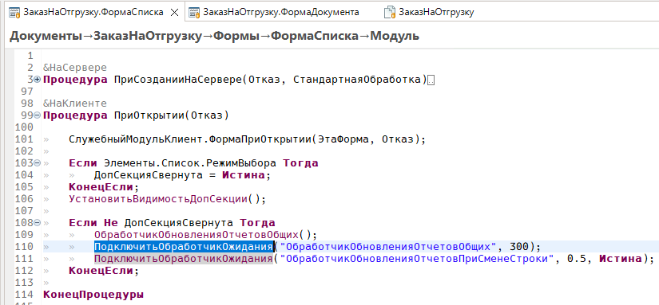

# Текстовые редакторы

Возможности Комфорт, общие для **редактируемых текстовых полей** EDT — не только для кода BSL. Специфика [редактора модуля](redaktor-modulya.md) и [редактора запроса](redaktor-zaprosa.md) — в соответствующих файлах.

---

## Где работает

- редактор **модуля BSL**;
- **модальный** редактор текста запроса;
- вложенные текстовые поля в редакторах метаданных и других частях среды EDT.

В модальном редакторе запроса Eclipse не доставляет стандартные привязки клавиш — Комфорт перехватывает **Ctrl+F3** / **Ctrl+Shift+F3** на уровне окна. В остальных полях команды работают через обычный механизм клавиш EDT.

---

## Быстрый поиск (Ctrl+F3) {#bystryj-poisk}

Комфорт заменяет штатные команды EDT **«Быстрый поиск вперёд»** и **«Быстрый поиск назад»** своими **«Быстрый поиск вперёд (Комфорт)»** / **«Быстрый поиск назад (Комфорт)»** с теми же сочетаниями **Ctrl+F3** и **Ctrl+Shift+F3**. В редакторе BSL штатный поиск работал непредсказуемо ([#93](https://github.com/tormozit/EDT.Comfort/issues/93)); Комфорт выполняет команду без диалога выбора между двумя привязками. Для BSL при старте создаётся USER-привязка в контексте **Редактирование источника Xtext**, которую можно изменить в **Параметры → Клавиши**.

### Что ищется

- Если есть **выделение** — ищется выделенный текст.
- Иначе — фрагмент **на текущей строке** под кареткой:
  - **идентификатор** — буквы (в т.ч. кириллица), цифры, `_` (имя `Моя_Переменная` захватывается целиком);
  - **пробелы** — непрерывный блок пробелов;
  - **прочие символы** — один «токен» из знаков пунктуации или операторов.

### Поведение

- **Вперёд (Ctrl+F3)** — следующее вхождение после каретки; если не найдено — **с начала** текста.
- **Назад (Ctrl+Shift+F3)** — предыдущее вхождение; если не найдено — **с конца** текста.
- Найденный фрагмент **выделяется**, редактор прокручивается к совпадению.

### Настройки поиска

Учитываются флажки штатного окна EDT **Найти/Заменить** (сохраняются между сессиями):

- **Учитывать регистр**
- **Только слово целиком**

### Отличие от Ctrl+← / Ctrl+→

**[Навигация по идентификатору](#navigaciya-po-identifikatoru)** перемещает каретку по **границам слова на строке**. **Быстрый поиск** переходит к **следующему или предыдущему вхождению** того же текста **по всему документу**.

Переназначение — **Параметры → Клавиши → Комфорт**. Отдельной настройки «включить/выключить» в параметрах Комфорт нет.

---

## Навигация по идентификатору {#navigaciya-po-identifikatoru}

**Клавиши:** Ctrl+← / Ctrl+→ — перемещение каретки; Ctrl+Shift+← / Ctrl+Shift+→ — выделение.

В текстовых полях EDT **Ctrl+←/→** и **Ctrl+Shift+←/→** используют границу **идентификатора** (буквы, цифры, `_`), а не sub-word в CamelCase. Имя `Моя_Переменная` воспринимается как одно слово — как в конфигураторе 1С.

Подключается к любому редактируемому полю **StyledText** при получении фокуса.

См. также [Быстрый поиск](#bystryj-poisk) — переход по **вхождениям** по всему тексту, а не по границам слова на строке.

---

## Вставить со сравнением {#vstavka-so-sravneniem}

**Клавиши:** Ctrl+Alt+V (контекст **«В окнах»**; срабатывает при фокусе в редактируемом текстовом поле)

Сравнение **выделенного** фрагмента с **буфером обмена** и вставка отредактированного текста. Команда доступна и в подменю **Комфорт** контекстного меню текстового поля (см. ниже).

Переназначение — **Параметры → Общие → Клавиши**, контекст **В окнах**.

---

## Сортировать строки текста {#sortirovat-stroki-teksta}

**Клавиши:** не назначены по умолчанию (контекст **«В окнах»**; срабатывает при фокусе в редактируемом текстовом поле) — назначьте в **Параметры → Общие → Клавиши** при необходимости.

Сортирует **выделенные строки** текста по алфавиту. Требуется выделение из двух и более строк. Команда доступна и в подменю **Комфорт** контекстного меню текстового поля (см. ниже).

---

## Контекстное меню «Комфорт»

В контекстном меню редактируемых текстовых полей EDT — подменю **Комфорт** с пунктами **Вставить со сравнением** (в подписи указано сочетание **Ctrl+Alt+V**) и **Сортировать строки текста**.

Команды ИР в подменю (форматирование и др.) описаны в [редакторе модуля](redaktor-modulya.md) и [редакторе запроса](redaktor-zaprosa.md).

---

## Правый клик

Правый клик в текстовом поле **перемещает каретку** в точку клика перед показом контекстного меню. Если клик попадает **внутрь текущего выделения**, выделение **сохраняется** (классическое поведение текстовых редакторов Eclipse).

---

## Горячие клавиши

| Команда | Клавиши |
|---------|---------|
| Быстрый поиск вперёд (Комфорт) | Ctrl+F3 |
| Быстрый поиск назад (Комфорт) | Ctrl+Shift+F3 |
| Навигация по идентификатору | Ctrl+← / Ctrl+→ |
| Вставить со сравнением | Ctrl+Alt+V |
| Сортировать строки текста | — (назначьте в Клавиши) |

Полный список и контексты привязок — [Горячие клавиши](goryachie-klavishi.md).
