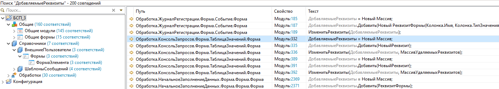

# Результаты поиска

Панель **Результаты поиска** (глобальный поиск по конфигурации EDT).

## Как открыть

Выполните штатный поиск EDT (**Поиск → Поиск…** или **Поиск в конфигурации**) или штатный поиск по файлам (**Поиск → Поиск по файлам…**). Результаты отображаются в представлении **Результаты поиска**.

## Результаты поиска в конфигурации

Для глобального поиска по конфигурации EDT (**Поиск → Поиск…**) доступны дополнительные возможности:

| Возможность | Описание |
|-------------|----------|
| Флажок **Слово целиком** | Ограничивает поиск точным совпадением искомого слова, а не подстрокой ([#102](https://github.com/tormozit/EDT.Comfort/issues/102)) |

## Результаты поиска по файлам

Для глобального поиска по файлам EDT (**Поиск → Поиск по файлам…**) доступны улучшения ([#100](https://github.com/tormozit/EDT.Comfort/issues/100), [#104](https://github.com/tormozit/EDT.Comfort/issues/104)):

| Возможность | Описание |
|-------------|----------|
| Агрегация вхождений | При выборе группового узла в дереве в правой таблице показываются вхождения **всех потомков** |
| Колонка «Путь» | Появляется при агрегации; путь — цепочка подписей узлов от корня дерева |
| Счётчик соответствий | В подписи узла дерева добавляется «(N соответствий)» |
| Копирование | В режиме агрегации **Ctrl+C** копирует текст активной ячейки; при нескольких колонках порядок — «Путь, Свойство» |
| Обновление при поиске | Правая таблица обновляется, пока поиск ещё выполняется |

## Настройка

- **Параметры → Комфорт → Улучшать списки** — включает агрегацию, колонку «Путь» и счётчики. При выключении панель поиска работает штатно.
- Флажок **Слово целиком** доступен непосредственно в окне поиска по конфигурации.

## Иллюстрации

Агрегированная таблица вхождений всех потомков групповой ветки, колонка «Путь», счётчики «(N соответствий)» в дереве:

