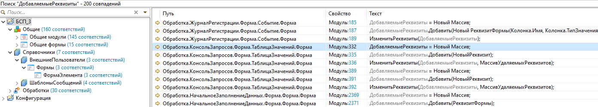

# Результаты поиска
Панель **Результаты поиска** (глобальный поиск по конфигурации EDT).
## Как открыть
Выполните штатный поиск EDT (**Поиск → Поиск…** или **Поиск в конфигурации**) или штатный поиск по файлам (**Поиск → Поиск по файлам…**). Результаты отображаются в представлении **Результаты поиска**.
## Результаты поиска в конфигурации
Для глобального поиска по конфигурации EDT (**Поиск → Поиск…**), а также для результатов команды **«Найти ссылки»**, доступны дополнительные возможности:
| Возможность | Описание |
|-------------|----------|
| Флажок **Слово целиком** | Ограничивает поиск точным совпадением искомого слова, а не подстрокой ([#102](https://github.com/tormozit/EDT.Comfort/issues/102)) |
| Агрегация вхождений | При выборе группового узла в дереве в правой таблице показываются вхождения **всех потомков** ([#79](https://github.com/tormozit/EDT.Comfort/issues/79)) |
| Колонка «Путь» | Полное имя объекта метаданных |
| Колонка «Свойство» | Иерархический путь к найденному свойству внутри объекта |
| Открытие вхождения | Активирует соответствующую страницу редактора (в т.ч. схемы компоновки данных и табличного документа) ([#209](https://github.com/tormozit/EDT.Comfort/issues/209)) и устанавливает фокус на соответствующее поле в панели **Свойства** ([#230](https://github.com/tormozit/EDT.Comfort/issues/230)) |
## Результаты поиска по файлам
Для глобального поиска по файлам EDT (**Поиск → Поиск по файлам…**) доступны улучшения ([#100](https://github.com/tormozit/EDT.Comfort/issues/100), [#104](https://github.com/tormozit/EDT.Comfort/issues/104)):
| Возможность | Описание |
|-------------|----------|
| Агрегация вхождений | При выборе группового узла в дереве в правой таблице показываются вхождения **всех потомков** |
| Колонка «Тип» | Тип найденного файла ([#230](https://github.com/tormozit/EDT.Comfort/issues/230)) |
| Колонка «Путь» | Полное имя объекта метаданных |
| Счётчик соответствий | В подписи узла дерева добавляется «(N соответствий)» |
| Копирование | В режиме агрегации **Ctrl+C** копирует текст активной ячейки; при нескольких колонках порядок — «Путь, Свойство» |
| Обновление при поиске | Правая таблица обновляется, пока поиск ещё выполняется |
| Открытие вхождения | Открывает **текстовый файл** с позиционированием на вхождение. Редактор объекта конфигурации открывается через контекстное меню |
| Колонки | Порядок и ширины колонок (а также положение разделителя дерева и таблицы) запоминаются между сеансами; при свободном месте колонки растягиваются на всю ширину таблицы — см. [Порядок и ширина колонок](obshchie-mekhanizmy.md#poryadok-i-shirina-kolonok) |
## Отбор по значению колонки
В контекстном меню таблицы вхождений — команды **«Отобрать по значению ячейки»** (Alt+W), **«Различные значения колонки»** (Alt+F) и **«Отключить все отборы»**. Подробнее — [Отбор по значению колонки](obshchie-mekhanizmy.md#otbor-po-znacheniyu-kolonki).
## Настройка
- **Параметры → Комфорт → Улучшать списки** — включает перечисленные улучшения.
- Флажок **Слово целиком** доступен непосредственно в окне поиска по конфигурации.

## Иллюстрации
Агрегированная таблица вхождений всех потомков групповой ветки, колонка «Путь», счётчики «(N соответствий)» в дереве:

