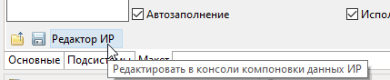

# Схема компоновки данных

Редактор **схемы компоновки данных (СКД)** на вкладке **Макет** в редакторе общих макетов и аналогичных объектов с DCS-страницей.

## Редактор ИР

Кнопка **Редактор ИР** на панели инструментов редактора наборов данных открывает схему в **консоли компоновки данных ИР** — полноценном редакторе СКД платформы 1С.

### Как вызвать

1. Откройте объект с макетом схемы компоновки (общий макет и т.п.).
2. Перейдите на вкладку **Макет** (редактор СКД).
3. На панели инструментов (рядом с командами загрузки) нажмите **Редактор ИР**.

### Условия

- Подключено [приложение ИР](obshchie-mekhanizmy.md#integraciya-s-ir) к информационной базе проекта.
- ИР установлены в этой базе.

Без сеанса ИР кнопка не выполняет действие.

### Что происходит

1. Комфорт экспортирует текущую схему из EDT во временный XML-файл.
2. В ИР открывается консоль компоновки данных с этой схемой (вызов `РедактироватьСхемуКомпоновкиИзФайлаЛкс`).
3. Появляется уведомление: изменённая схема вернётся в EDT, **если схема не редактировалась в EDT** во время работы в ИР.

### Возврат изменений в EDT

После сохранения в ИР выполните **переход обратно в EDT** штатной командой ИР (связь через механизм «Перейти к определению» / транспортный каталог ИР↔EDT).

- Комфорт сравнивает снимок схемы, сделанный при открытии, с текущим состоянием в EDT.
- Если схема в EDT **не менялась** — загружается версия из ИР.
- Если схема была изменена в EDT параллельно — загрузка **не выполняется**; Комфорт покажет уведомление с путём к временному файлу.

> Не редактируйте ту же схему одновременно в EDT и в ИР — иначе изменения из ИР не применятся автоматически.

## Общие механизмы

<!-- Сортировка по алфавиту (А–Я). При добавлении — вставлять строку на нужную позицию. -->
- [Интеграция с ИР](obshchie-mekhanizmy.md#integraciya-s-ir)
- [Переход к определению](obshchie-mekhanizmy.md#perehod-k-opredeleniyu) — используется при возврате из ИР

## См. также

- [Редактор табличного документа](redaktor-tablichnogo-dokumenta.md) — **Редактор ИР** для табличного документа (контекстное меню)
