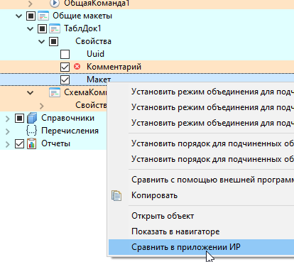
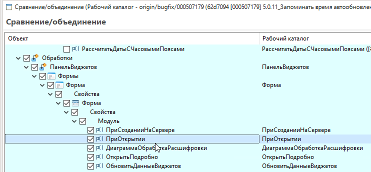
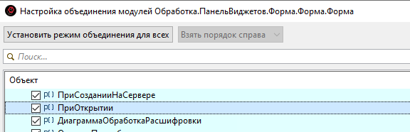
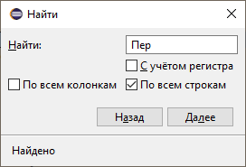

# Сравнение конфигураций

Редактор сравнения EDT.

## Команды в контекстном меню дерева

При выборе сопоставленного узла в дереве сравнения Комфорт добавляет в **контекстное меню** дерева:

| Действие | Клавиши | Описание |
|----------|---------|----------|
| Открыть объект | F2 | Открыть выбранный объект в редакторе |
| Показать в навигаторе | Ctrl+T | Выделить объект в [навигаторе](navigator.md) |
| Сравнить в приложении ИР | — | Сравнение макета табличного документа в ИР (см. ниже) |

## Сравнить в приложении ИР

Трёхстороннее сравнение **макетов табличного документа** в редакторе **Инструментов разработчика (ИР)** — удобнее штатного просмотра различий в EDT.

### Поддерживается

Только свойство **«ТабличныйДокумент.Макет»** (внешнее свойство сравнения). Для других узлов при вызове из меню появится уведомление: «Поддерживаются свойства: ТабличныйДокумент.Макет».

### Условия

- ИР [установлены](obshchie-mekhanizmy.md#integraciya-s-ir) в базе; платформа — Windows (COM).

### Как использовать

1. Выделите в дереве узел макета табличного документа (изменённое свойство сравнения).
2. Контекстное меню → **Сравнить в приложении ИР**.
3. Комфорт экспортирует версии **основной**, **другой** и при наличии — **общего предка** во временные файлы `.xmxl`.
4. В ИР открывается сравнение табличных документов.

## Двойной щелчок в дереве

Двойной щелчок учитывает элемент **под курсором** (в любой колонке строки), а не только текущее выделение.

| Узел под курсором | Действие |
|-------------------|----------|
| **Модуль** | Открывается диалог **настройки объединения / сравнения модуля** EDT |
| **Секция модуля** (область, процедуры…) | То же; если модуль с разбором структуры — в диалоге **автовыбирается** соответствующая секция |
| **ТабличныйДокумент.Макет** | То же, что **Сравнить в приложении ИР** |

## Развернуть (панель инструментов)

На панели редактора сравнения — кнопка **Развернуть** с выпадающим меню:

| Пункт | Эффект |
|-------|--------|
| **До измененных** | Развернуть всё, кроме добавленных/удалённых узлов |
| **До объектов** | Развернуть до верхних объектов конфигурации |
| **До помеченных** | Развернуть до узлов с установленным чекбоксом |

## Поиск по дереву

Штатный поиск EDT в редакторе сравнения (**Ctrl+F**) дополнен Комфорт:

- Поиск выполняется **в фоне** (не блокирует интерфейс); длительный поиск можно прервать.
- Флажок **По всем строкам** — искать не только по строкам имён объектов, но и по всем строкам дерева.
- Флажок **По всем колонкам** — дополнительно искать в колонке «Объект», помимо колонок значений.
- Флажок **Слово целиком** — ограничивает поиск точным совпадением искомого слова.
- Кнопка **Найти все** ([#112](https://github.com/tormozit/EDT.Comfort/issues/112)) — выполнить поиск всех вхождений фильтра по дереву.
- Настройки флажков сохраняются между сессиями EDT.

## Рекурсивное развёртывание

При поиске по дереву строка автоматически развёртывается, если у узла только один дочерний элемент — рекурсивно, пока не будет найден нужный узел или пока ветка не разветвится ([#105](https://github.com/tormozit/EDT.Comfort/issues/105)).

## Окна сравнения текстов

В окнах сравнения / объединения текстов модулей ([#85](https://github.com/tormozit/EDT.Comfort/issues/85)):

- снизу — **вертикальное сравнение текущей строки** (как в сравнителе ИР), включается и отключается запоминаемой кнопкой;
- более плотная компоновка штатных контролов по высоте;
- команда **«Показать в модуле»** — переход к соответствующему месту в редакторе модуля;
- кнопка **«Сравнить ИР»** на командной панели (при подключённом ИР).

## Сравнение ролей

В окне **«Сравнение ролей»** подключен [иерархический фильтр](obshchie-mekhanizmy.md#filtry-po-podstroke-v-spiskah) с раскраской вхождений и историей фильтра ([#185](https://github.com/tormozit/EDT.Comfort/issues/185)).

## Общие механизмы
<!-- Сортировка по алфавиту (А–Я). При добавлении — вставлять строку на нужную позицию. -->
- [Интеграция с ИР](obshchie-mekhanizmy.md#integraciya-s-ir)
- [Копирование ссылки](obshchie-mekhanizmy.md#kopirovanie-ssylki)
- [Переход к определению](obshchie-mekhanizmy.md#perehod-k-opredeleniyu)
