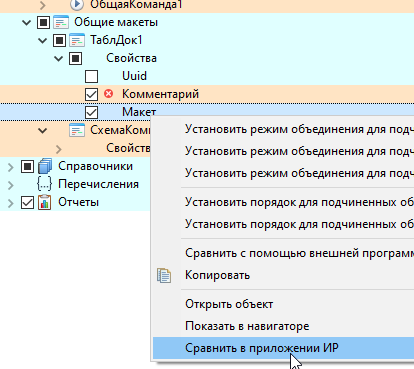
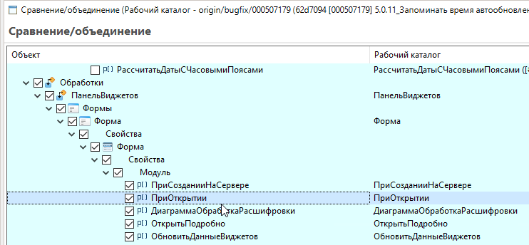
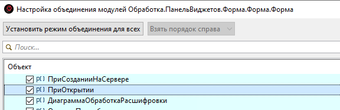
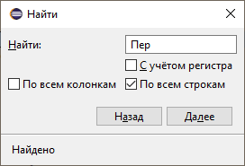

# Сравнение конфигураций
Редактор сравнения EDT.
## Связь с навигатором
- Выделение в дереве сравнения может синхронизироваться с [навигатором](navigator.md) (режим «Связать с редактором»).
- Команда **Показать в навигаторе** (Ctrl+T) — принудительно выделить объект в навигаторе.
- **Перетаскивание** объекта метаданных из навигатора на дерево сравнения выделяет соответствующую строку в дереве; в обратную сторону (из дерева сравнения на навигатор) — то же, что **Показать в навигаторе** ([#286](https://github.com/tormozit/EDT.Comfort/issues/286)).

## Команды в контекстном меню дерева
При выборе сопоставленного узла в дереве сравнения Комфорт добавляет в **контекстное меню** дерева:
| Действие | Клавиши | Описание |
|----------|---------|----------|
| Открыть объект | F2 | Открыть выбранный объект в редакторе |
| Показать в навигаторе | Ctrl+T | Выделить объект в [навигаторе](navigator.md) |
| Найти нижние настраиваемые | — | Список листовых настраиваемых узлов в поддереве выделения — без детей с пометками ([#240](https://github.com/tormozit/EDT.Comfort/issues/240)) |
| Сравнить в приложении ИР | — | Только для файлов `.mxlx` — сравнение макета табличного документа в ИР (см. ниже) |
## Мультивыделение и пометки
В дереве сравнения — **мультивыделение** (Ctrl/Shift) и **групповая** установка/снятие пометок для всех выделенных строк ([#234](https://github.com/tormozit/EDT.Comfort/issues/234)).
Флажок **«Каскадный пересчёт пометок с учётом фильтра (экспериментально)»** на панели редактора — при каскадной установке пометок учитываются текущий **отбор по подсистемам** и combo **«Показывать…»** (узлы, скрытые фильтром, не затрагиваются). Состояние флажка запоминается между сеансами ([#248](https://github.com/tormozit/EDT.Comfort/issues/248)).
## Сравнить в приложении ИР :id=sravnit-v-prilozhenii-ir
Трёхстороннее сравнение **макетов табличного документа** (файлы **`.mxlx`**) в редакторе **Инструментов разработчика (ИР)** — удобнее штатного просмотра различий в EDT.
### Поддерживается
Только узлы с файлом расширения **`.mxlx`** (свойство **«ТабличныйДокумент.Макет»**). Пункт меню появляется **только** для таких узлов.
### Условия
- ИР [установлены](obshchie-mekhanizmy.md#integraciya-s-ir) в базе; платформа — Windows (COM).

### Как использовать
1. Выделите в дереве узел макета табличного документа (файл `.mxlx`).
2. Контекстное меню → **Сравнить в приложении ИР**.
3. Комфорт экспортирует версии **основной**, **другой** и при наличии — **общего предка** во временные файлы `.mxlx`.
4. В ИР открывается сравнение табличных документов.

## Двойной щелчок в дереве
Двойной щелчок учитывает элемент **под курсором** (в любой колонке строки), а не только текущее выделение.
| Узел под курсором | Действие |
|-------------------|----------|
| **Модуль** | Открывается диалог **настройки объединения / сравнения модуля** EDT |
| **Секция модуля** (область, процедуры…) | То же; если модуль с разбором структуры — в диалоге **автовыбирается** соответствующая секция |
| **ТабличныйДокумент.Макет** | То же, что **Сравнить в приложении ИР** |
| **Настройки проекта** | Список изменившихся файлов `.settings` (иконка добавлен/удалён/изменён) → сравнение текстов версий выбранного файла |

## Развернуть (панель инструментов)
На панели редактора сравнения — кнопка **Развернуть** с выпадающим меню:
| Пункт | Эффект |
|-------|--------|
| **До измененных** | Развернуть всё, кроме добавленных/удалённых узлов |
| **До объектов** | Развернуть до верхних объектов конфигурации |
| **До помеченных** | Развернуть до узлов с установленной пометкой |
**Ctrl+клик** по плюсику или минусу — общее [разворачивание и сворачивание поддерева](obshchie-mekhanizmy.md#razvorachivanie-poddereva); разворот здесь идёт командой **До измененных** ([#10](https://github.com/tormozit/EDT.Comfort/issues/10)).
## Поиск по дереву
Штатный поиск EDT в редакторе сравнения (**Ctrl+F**) дополнен Комфорт:
- Поиск выполняется **в фоне** (не блокирует интерфейс); длительный поиск можно прервать; поиск запускается сразу при открытии окна, не дожидаясь ввода.
- Флажок **По всем строкам** — искать не только по строкам имён объектов, но и по всем строкам дерева с **отличиями** (как фильтр «Показывать отличия»). Обрезка спуска на одностороннем невиртуальном узле действует только у **потомков узлов форм** (чтобы не раздувать обход элементов формы); остальные узлы с отличиями входят в индекс целиком. Работает и в режиме чистого сравнения без пометок (например, два коммита).
- Флажок **По всем колонкам** — дополнительно искать в колонке «Объект», помимо колонок значений.
- Флажок **Слово целиком** — ограничивает поиск точным совпадением искомого слова ([#222](https://github.com/tormozit/EDT.Comfort/issues/222)).
- Кнопка **Найти все** ([#112](https://github.com/tormozit/EDT.Comfort/issues/112)) — выполнить поиск всех вхождений фильтра по дереву.
- В результатах поиска (таблица найденных вхождений) — **групповое изменение пометок** для выделенных строк ([#227](https://github.com/tormozit/EDT.Comfort/issues/227)).
- Настройки флажков сохраняются между сессиями EDT.

## Рекурсивное развёртывание
При поиске по дереву строка автоматически развёртывается, если у узла только один дочерний элемент — рекурсивно, пока не будет найден нужный узел или пока ветка не разветвится ([#105](https://github.com/tormozit/EDT.Comfort/issues/105)).
## Отбор по подсистемам в дереве сравнения
Диалог отбора по подсистемам, вызываемый из редактора сравнения, — тот же, что описан в [Отбор по подсистемам](otbor-po-podsistemam.md), включая замену поля фильтра и доработки групповой установки флажков.
- Фильтрация дерева сравнения по подсистемам теперь учитывает и **удалённые** объекты (раньше отбор их игнорировал) ([#210](https://github.com/tormozit/EDT.Comfort/issues/210)).
- Добавлены варианты фильтра **«Только присутствующие в X»** для режима **3-стороннего** сравнения конфигураций ([#224](https://github.com/tormozit/EDT.Comfort/issues/224)).
- Групповая установка флажков в дереве сравнения (через ветку и кнопки панели) теперь учитывает текущий отбор по подсистемам — не трогает узлы, скрытые фильтром ([#223](https://github.com/tormozit/EDT.Comfort/issues/223)).

## Окна сравнения текстов
В окнах сравнения / объединения текстов ([#85](https://github.com/tormozit/EDT.Comfort/issues/85)), включая попарное **«Сравнение текста»** из 3-way диалога:
- снизу — **вертикальное сравнение текущей строки** (как в сравнителе ИР), включается и отключается запоминаемой кнопкой;
- более плотная компоновка штатных контролов по высоте;
- команда **«Показать в модуле»** — переход к соответствующему месту в редакторе модуля (в диалогах объединения модулей);
- кнопка **«Сравнить ИР»** на командной панели — открывает тексты сторон в форме сравнения ИР;
- для макетов табличного документа (**`.mxlx`**) — кнопка **«Сравнить таблично ИР»** ([#186](https://github.com/tormozit/EDT.Comfort/issues/186)): открывает **штатное сравнение табличных документов** в приложении ИР (то же, что **[Сравнить в приложении ИР](#sravnit-v-prilozhenii-ir)** из дерева сравнения);
- для сравнения **модулей BSL** — кнопка **«Структура»**: панель с деревом различающихся секций модуля над текстом сравнения; выбор узла дерева прокручивает и подсвечивает соответствующий диапазон в тексте. Выключена по умолчанию, состояние запоминается между сессиями ([#232](https://github.com/tormozit/EDT.Comfort/issues/232)).

## Сравнение ролей
В окне **«Сравнение ролей»** подключен [иерархический фильтр](obshchie-mekhanizmy.md#filtry-po-podstroke-v-spiskah) с раскраской вхождений и историей фильтра ([#185](https://github.com/tormozit/EDT.Comfort/issues/185)).
## Общие механизмы
<!-- Сортировка по алфавиту (А–Я). При добавлении — вставлять строку на нужную позицию. -->
- [Интеграция с ИР](obshchie-mekhanizmy.md#integraciya-s-ir)
- [Копирование ссылки](obshchie-mekhanizmy.md#kopirovanie-ssylki)
- [Переход к определению](obshchie-mekhanizmy.md#perehod-k-opredeleniyu)
- [Разворачивание и сворачивание поддерева](obshchie-mekhanizmy.md#razvorachivanie-poddereva)
